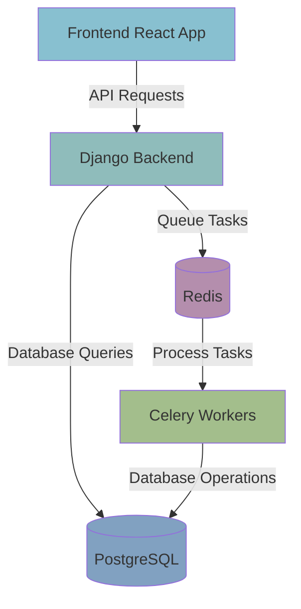

# Backend Implementation Plan

## Overview

This document outlines the detailed plan for implementing a Django-based backend with PostgreSQL database for the Broadcast Management System. The backend will be containerized using Docker to ensure consistent development and deployment environments.

## Architecture



### Components

1. **Frontend**: React application (existing)
   - Will remain separate initially
   - Will connect to the containerized backend API

2. **Backend**: Django with Django REST Framework
   - Containerized with Docker
   - RESTful API endpoints matching current frontend expectations

3. **Database**: PostgreSQL
   - Containerized with Docker
   - Persistent volume for data storage

4. **Task Queue**: Celery (optional for initial phase)
   - For background processing and scheduled tasks

5. **Message Broker**: Redis
   - For caching and message queueing
   - Required for Celery if implemented

## Implementation Phases

### Phase 1: Docker Infrastructure Setup (1-2 weeks)

#### Objectives
- Set up Docker development environment
- Configure Docker Compose for local development
- Ensure proper communication between services

#### Tasks
1. **Docker Configuration**
   - Create Dockerfile for Django application
   - Set up docker-compose.yml with all required services
   - Configure environment variables and secrets management
   - Set up development and production configurations
   - Configure persistent volumes for database

2. **Environment Setup**
   - Create development, staging, and production environment configurations
   - Set up environment variable management
   - Configure logging for containers

3. **Testing Infrastructure**
   - Set up container health checks
   - Create Docker test environment
   - Configure CI/CD pipeline integration points

### Phase 2: Django Backend Implementation (3-4 weeks)

#### Objectives
- Develop Django application structure
- Implement database models
- Create API endpoints matching frontend expectations

#### Tasks
1. **Project Setup**
   - Initialize Django project with appropriate structure
   - Configure Django REST Framework
   - Set up database connection to PostgreSQL
   - Configure static and media files handling

2. **Authentication System**
   - Implement JWT or session-based authentication matching frontend
   - Configure CSRF protection compatible with frontend
   - Set up permission classes for different user roles
   - Create user model and profile extensions

3. **Database Models**
   - Create models for all entities required by the frontend:
     - User and Profile models
     - Locations and Facilities
     - Shifts and scheduling data
     - Tickets (Incident and Service)
     - Time entries and scheduling
     - Events and notifications

4. **API Development**
   - Create serializers for all models
   - Implement viewsets and URL routing
   - Ensure pagination matches frontend expectations
   - Set up filtering and search capabilities
   - Document API endpoints with drf-yasg or similar

5. **Background Tasks (if needed)**
   - Configure Celery for asynchronous tasks
   - Implement scheduled tasks for recurring operations
   - Set up result backend and monitoring

### Phase 3: Integration and Testing (2-3 weeks)

#### Objectives
- Ensure backend API works with existing frontend
- Test all functionality thoroughly
- Document API for frontend developers

#### Tasks
1. **API Verification**
   - Ensure all endpoints match frontend expectations
   - Test authentication flow
   - Verify CRUD operations for all entities
   - Test pagination and filtering

2. **Integration Testing**
   - Update frontend API configuration to point to new backend
   - Test all frontend features against new backend
   - Address any compatibility issues

3. **Performance Testing**
   - Load test API endpoints
   - Optimize database queries
   - Implement caching where appropriate
   - Monitor and tune database performance

4. **Documentation**
   - Create comprehensive API documentation
   - Document setup and deployment procedures
   - Create development guides for future contributors

### Phase 4: Deployment and Monitoring (1-2 weeks)

#### Objectives
- Deploy backend to production environment
- Set up monitoring and alerting
- Establish backup procedures

#### Tasks
1. **Production Deployment**
   - Configure production Docker environment
   - Set up container orchestration (if needed)
   - Implement HTTPS with proper certificates
   - Configure database backup procedures

2. **Monitoring Setup**
   - Implement application monitoring
   - Set up error tracking
   - Configure performance monitoring
   - Create alerting for critical issues

3. **Maintenance Planning**
   - Document update procedures
   - Plan for database migrations
   - Set up automated backups
   - Create disaster recovery procedures

## Technical Details

### Docker Configuration

```yaml
# Example docker-compose.yml structure
version: '3.8'

services:
  db:
    image: postgres:14
    volumes:
      - postgres_data:/var/lib/postgresql/data/
    env_file:
      - ./.env.db
    ports:
      - "5432:5432"
    networks:
      - backend-network
    healthcheck:
      test: ["CMD-SHELL", "pg_isready -U postgres"]
      interval: 10s
      timeout: 5s
      retries: 5
      
  redis:
    image: redis:alpine
    ports:
      - "6379:6379"
    networks:
      - backend-network
    healthcheck:
      test: ["CMD", "redis-cli", "ping"]
      interval: 10s
      timeout: 5s
      retries: 5
      
  web:
    build: ./backend
    command: gunicorn backend.wsgi:application --bind 0.0.0.0:8000
    volumes:
      - ./backend:/app
      - static_volume:/app/staticfiles
      - media_volume:/app/mediafiles
    env_file:
      - ./.env.dev
    ports:
      - "8000:8000"
    depends_on:
      - db
      - redis
    networks:
      - backend-network
    restart: unless-stopped
      
  celery:
    build: ./backend
    command: celery -A backend worker -l INFO
    volumes:
      - ./backend:/app
    env_file:
      - ./.env.dev
    depends_on:
      - web
      - redis
      - db
    networks:
      - backend-network
    restart: unless-stopped

  celery-beat:
    build: ./backend
    command: celery -A backend beat -l INFO
    volumes:
      - ./backend:/app
    env_file:
      - ./.env.dev
    depends_on:
      - web
      - redis
      - db
    networks:
      - backend-network
    restart: unless-stopped

volumes:
  postgres_data:
  static_volume:
  media_volume:

networks:
  backend-network:
    driver: bridge
```

### Django Models

```python
# Example User Profile model
from django.db import models
from django.contrib.auth.models import User

class Profile(models.Model):
    user = models.OneToOneField(User, on_delete=models.CASCADE, related_name='profile')
    title = models.CharField(max_length=100, blank=True)
    department = models.CharField(max_length=100, blank=True)
    phone = models.CharField(max_length=20, blank=True)
    location = models.ForeignKey('Location', on_delete=models.SET_NULL, null=True, blank=True)
    profile_image = models.ImageField(upload_to='profiles/', null=True, blank=True)
    
    def __str__(self):
        return f"{self.user.username}'s profile"
```

### API Endpoints

The backend will implement the following API endpoints to match the frontend expectations:

1. **Authentication**
   - `POST /api/auth/login/` - Log in user
   - `POST /api/auth/logout/` - Log out user
   - `GET /api/auth/user/` - Get current user

2. **Users and Profiles**
   - `GET /api/profiles/` - List all profiles
   - `GET /api/profiles/:id/` - Get specific profile
   - `POST /api/profiles/` - Create profile
   - `PATCH /api/profiles/:id/` - Update profile

3. **Locations and Facilities**
   - `GET /api/locations/` - List locations
   - `POST /api/locations/` - Create location
   - `GET /api/facilities/` - List facilities
   - `POST /api/facilities/` - Create facility

4. **Shifts**
   - `GET /api/shifts/` - List shifts
   - `POST /api/shifts/` - Create shift

5. **Incidents**
   - `GET /api/incident-types/` - List incident types
   - `GET /api/incident-tickets/` - List incident tickets
   - `GET /api/incident-tickets/:id/` - Get specific incident ticket
   - `POST /api/incident-tickets/` - Create incident ticket
   - `PATCH /api/incident-tickets/:id/` - Update incident ticket

6. **Service**
   - `GET /api/service-tickets/` - List service tickets
   - `GET /api/service-tickets/:id/` - Get specific service ticket
   - `POST /api/service-tickets/` - Create service ticket
   - `PATCH /api/service-tickets/:id/` - Update service ticket

7. **Time Entries**
   - `GET /api/time-entries/` - List time entries
   - `POST /api/time-entries/` - Create time entry
   - `PATCH /api/time-entries/:id/` - Update time entry

8. **Scheduling**
   - `GET /api/scheduled-events/` - List scheduled events
   - `POST /api/scheduled-events/` - Create scheduled event
   - `PATCH /api/scheduled-events/:id/` - Update scheduled event
   - `GET /api/time-off-requests/` - List time-off requests
   - `POST /api/time-off-requests/` - Create time-off request
   - `PATCH /api/time-off-requests/:id/` - Update time-off request

9. **Utilities**
   - `POST /api/send-email/` - Send email
   - `GET /api/csrf/` - Get CSRF token

### Authentication System

The backend will implement session-based authentication with CSRF token support to match the existing frontend authentication flow:

1. **Login Process**
   - Frontend sends credentials to backend
   - Backend verifies credentials and creates session
   - Backend returns user information
   - Frontend stores user information in context

2. **Session Management**
   - Sessions stored in database
   - Redis for caching sessions (optional)
   - CSRF protection for all non-GET requests

3. **Permission System**
   - Role-based permissions matching frontend expectations
   - Object-level permissions where needed
   - Permission checks in all relevant API endpoints

## Development Workflow

### Local Development

1. Clone repository
2. Copy `.env.example` to `.env.dev` and configure
3. Run `docker-compose up -d`
4. Access Django at `http://localhost:8000`
5. Access frontend separately (not containerized initially)

### Testing

1. Unit tests for models and serializers
2. Integration tests for API endpoints
3. End-to-end tests with frontend

### Code Standards

1. PEP 8 for Python code
2. Comprehensive documentation
3. Type hints where applicable
4. Thorough test coverage

## Risk Management

### Potential Challenges

1. **Authentication Compatibility**
   - Risk: Frontend authentication flow may not match backend implementation
   - Mitigation: Carefully review frontend auth code and implement matching backend system

2. **API Contract Matching**
   - Risk: Backend API responses may not match frontend expectations
   - Mitigation: Test each endpoint thoroughly with frontend, ensure pagination and response formats match

3. **Performance Issues**
   - Risk: Database queries may not be optimized for performance
   - Mitigation: Implement query optimization, caching, and monitoring

4. **Data Migration**
   - Risk: Moving from mock data to real database may reveal data inconsistencies
   - Mitigation: Create robust data validation and migration scripts

## Future Considerations

1. **Frontend Containerization**
   - Containerize frontend in future phases
   - Implement unified docker-compose setup

2. **Scaling Strategy**
   - Horizontal scaling for Django application
   - Database replication and sharding
   - Load balancing configuration

3. **Enhanced Security**
   - Security auditing procedures
   - Penetration testing
   - Regular dependency updates

4. **Advanced Features**
   - Real-time notifications with WebSockets
   - Enhanced reporting capabilities
   - AI-powered scheduling recommendations

## Conclusion

This implementation plan provides a structured approach to developing a Django backend with PostgreSQL that works seamlessly with the existing frontend. By following this plan, we'll ensure that the backend respects the current API contract while providing a robust, containerized solution that can scale for future needs. 