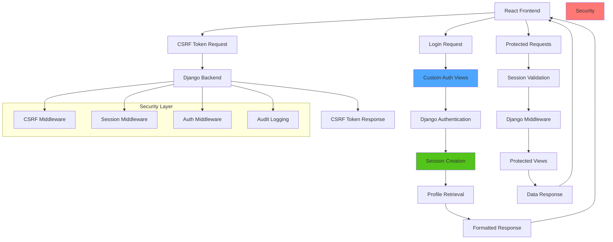

# Backend Authentication

This document covers the planned authentication system for the Django backend, designed to seamlessly integrate with the existing frontend authentication patterns while providing robust security and session management.

## Overview

The backend authentication system uses Django's built-in session framework enhanced with custom views and response formatting to ensure exact compatibility with the frontend API expectations. This approach provides enterprise-grade security while maintaining the existing frontend authentication flow without requiring any frontend modifications.

## Architecture



## Authentication Strategy

Based on the creative phase decision, the backend implements **Hybrid Session Auth with Custom Response Layer**:

### Key Components

1. **Django Session Framework**: Core authentication mechanism
2. **Custom Authentication Views**: Frontend-compatible response formatting
3. **CSRF Protection**: Django's CSRF middleware for request security
4. **Profile Integration**: Automatic profile data retrieval
5. **Audit Logging**: Security event tracking

### Design Principles

- **Frontend Compatibility**: Zero frontend changes required
- **Security First**: Enterprise-grade security practices
- **Performance Optimized**: Efficient session and profile handling
- **Audit Ready**: Comprehensive logging for compliance
- **Scalable**: Designed for future horizontal scaling

## Custom Authentication Views

### CSRF Token Endpoint

```python
from django.http import JsonResponse
from django.middleware.csrf import get_token
from django.views.decorators.http import require_http_methods

@require_http_methods(["GET"])
def csrf_token_view(request):
    """
    Provides CSRF token for frontend authentication.
    Frontend expects: { "csrfToken": "token_value" }
    """
    token = get_token(request)
    return JsonResponse({
        'csrfToken': token
    })
```

### Login View

```python
from django.contrib.auth import authenticate, login
from django.contrib.auth.models import User
from django.http import JsonResponse
from django.views.decorators.csrf import csrf_protect
from django.views.decorators.http import require_http_methods
from django.utils.decorators import method_decorator
from django.views import View
import json

@method_decorator(csrf_protect, name='dispatch')
class LoginView(View):
    def post(self, request):
        """
        Custom login view that matches frontend expectations.
        Frontend expects DjangoUser object response.
        """
        try:
            data = json.loads(request.body)
            username = data.get('username')
            password = data.get('password')
            
            if not username or not password:
                return JsonResponse({
                    'detail': 'Username and password are required'
                }, status=400)
            
            # Authenticate user
            user = authenticate(request, username=username, password=password)
            
            if user is not None:
                if user.is_active:
                    # Log in the user (creates session)
                    login(request, user)
                    
                    # Log authentication event
                    audit_log_login(user, request)
                    
                    # Return user data in expected format
                    return JsonResponse({
                        'id': user.id,
                        'username': user.username,
                        'email': user.email,
                        'first_name': user.first_name,
                        'last_name': user.last_name,
                        'is_staff': user.is_staff,
                        'is_active': user.is_active,
                        'date_joined': user.date_joined.isoformat(),
                        'last_login': user.last_login.isoformat() if user.last_login else None,
                    })
                else:
                    return JsonResponse({
                        'detail': 'Account is disabled'
                    }, status=401)
            else:
                # Log failed attempt
                audit_log_failed_login(username, request)
                
                return JsonResponse({
                    'detail': 'Invalid credentials'
                }, status=401)
                
        except json.JSONDecodeError:
            return JsonResponse({
                'detail': 'Invalid JSON data'
            }, status=400)
        except Exception as e:
            # Log system error
            audit_log_error('login_error', str(e), request)
            
            return JsonResponse({
                'detail': 'An error occurred during login'
            }, status=500)
```

### Logout View

```python
from django.contrib.auth import logout
from django.http import JsonResponse
from django.views.decorators.csrf import csrf_protect
from django.views.decorators.http import require_http_methods

@csrf_protect
@require_http_methods(["POST"])
def logout_view(request):
    """
    Custom logout view with audit logging.
    Frontend expects empty response with 200 status.
    """
    if request.user.is_authenticated:
        user = request.user
        audit_log_logout(user, request)
        logout(request)
    
    return JsonResponse({})
```

### Current User View

```python
from django.http import JsonResponse
from django.contrib.auth.decorators import login_required
from django.views.decorators.http import require_http_methods

@login_required
@require_http_methods(["GET"])
def current_user_view(request):
    """
    Returns current authenticated user data.
    Frontend expects DjangoUser object format.
    """
    user = request.user
    
    return JsonResponse({
        'id': user.id,
        'username': user.username,
        'email': user.email,
        'first_name': user.first_name,
        'last_name': user.last_name,
        'is_staff': user.is_staff,
        'is_active': user.is_active,
        'date_joined': user.date_joined.isoformat(),
        'last_login': user.last_login.isoformat() if user.last_login else None,
    })
```

## Session Configuration

### Django Settings

```python
# settings.py

# Session Configuration
SESSION_ENGINE = 'django.contrib.sessions.backends.db'  # Database-backed sessions
SESSION_COOKIE_AGE = 60 * 60 * 24 * 7  # 7 days
SESSION_COOKIE_SECURE = True  # HTTPS only in production
SESSION_COOKIE_HTTPONLY = True  # Prevent XSS
SESSION_COOKIE_SAMESITE = 'Lax'  # CSRF protection
SESSION_SAVE_EVERY_REQUEST = True  # Extend session on activity
SESSION_EXPIRE_AT_BROWSER_CLOSE = False  # Persistent sessions

# CSRF Configuration
CSRF_COOKIE_SECURE = True  # HTTPS only in production
CSRF_COOKIE_HTTPONLY = False  # JavaScript needs access
CSRF_COOKIE_SAMESITE = 'Lax'  # CSRF protection
CSRF_TRUSTED_ORIGINS = [
    'https://app.capparelli.ie',
    'http://localhost:5173',  # Development frontend
]

# Authentication Configuration
LOGIN_URL = '/api/auth/login/'
LOGIN_REDIRECT_URL = '/'
LOGOUT_REDIRECT_URL = '/login'

# Password Security
AUTH_PASSWORD_VALIDATORS = [
    {
        'NAME': 'django.contrib.auth.password_validation.UserAttributeSimilarityValidator',
    },
    {
        'NAME': 'django.contrib.auth.password_validation.MinimumLengthValidator',
        'OPTIONS': {
            'min_length': 8,
        }
    },
    {
        'NAME': 'django.contrib.auth.password_validation.CommonPasswordValidator',
    },
    {
        'NAME': 'django.contrib.auth.password_validation.NumericPasswordValidator',
    },
]

# Security Headers
SECURE_BROWSER_XSS_FILTER = True
SECURE_CONTENT_TYPE_NOSNIFF = True
X_FRAME_OPTIONS = 'DENY'
```

### Middleware Stack

```python
# settings.py

MIDDLEWARE = [
    'django.middleware.security.SecurityMiddleware',
    'django.contrib.sessions.middleware.SessionMiddleware',
    'corsheaders.middleware.CorsMiddleware',  # For CORS handling
    'django.middleware.common.CommonMiddleware',
    'django.middleware.csrf.CsrfViewMiddleware',
    'django.contrib.auth.middleware.AuthenticationMiddleware',
    'django.contrib.messages.middleware.MessageMiddleware',
    'django.middleware.clickjacking.XFrameOptionsMiddleware',
    'apps.authentication.middleware.AuditLogMiddleware',  # Custom audit logging
]
```

## Profile Integration

### Automatic Profile Retrieval

The authentication system automatically handles profile data to match frontend expectations:

```python
from apps.users.models import Profile

def get_user_with_profile(user):
    """
    Helper function to get user data with profile information.
    Used in authentication views to provide complete user context.
    """
    try:
        profile = Profile.objects.get(user=user)
        return {
            'user': {
                'id': user.id,
                'username': user.username,
                'email': user.email,
                'first_name': user.first_name,
                'last_name': user.last_name,
                'is_staff': user.is_staff,
                'is_active': user.is_active,
                'date_joined': user.date_joined.isoformat(),
                'last_login': user.last_login.isoformat() if user.last_login else None,
            },
            'profile': {
                'id': profile.id,
                'full_name': profile.full_name,
                'email': profile.email,
                'phone': profile.phone,
                'position': profile.position,
                'department': profile.department,
                'start_date': profile.start_date.isoformat() if profile.start_date else None,
                'status': profile.status,
                'created_at': profile.created_at.isoformat(),
                'updated_at': profile.updated_at.isoformat(),
            }
        }
    except Profile.DoesNotExist:
        return {
            'user': {
                'id': user.id,
                'username': user.username,
                'email': user.email,
                'first_name': user.first_name,
                'last_name': user.last_name,
                'is_staff': user.is_staff,
                'is_active': user.is_active,
                'date_joined': user.date_joined.isoformat(),
                'last_login': user.last_login.isoformat() if user.last_login else None,
            },
            'profile': None
        }
```

## Security Features

### Audit Logging

Comprehensive audit logging for security events:

```python
# apps/authentication/models.py

from django.db import models
from django.contrib.auth.models import User
from django.utils import timezone

class AuditLog(models.Model):
    EVENT_TYPES = [
        ('login_success', 'Login Success'),
        ('login_failed', 'Login Failed'),
        ('logout', 'Logout'),
        ('session_expired', 'Session Expired'),
        ('password_change', 'Password Change'),
        ('user_created', 'User Created'),
        ('user_updated', 'User Updated'),
        ('permission_denied', 'Permission Denied'),
        ('system_error', 'System Error'),
    ]
    
    user = models.ForeignKey(User, on_delete=models.SET_NULL, null=True, blank=True)
    event_type = models.CharField(max_length=50, choices=EVENT_TYPES)
    timestamp = models.DateTimeField(default=timezone.now)
    ip_address = models.GenericIPAddressField()
    user_agent = models.TextField(blank=True)
    details = models.JSONField(default=dict)
    session_key = models.CharField(max_length=40, blank=True)
    
    class Meta:
        ordering = ['-timestamp']
        indexes = [
            models.Index(fields=['user', 'timestamp']),
            models.Index(fields=['event_type', 'timestamp']),
            models.Index(fields=['ip_address', 'timestamp']),
        ]

# Audit logging functions
def audit_log_login(user, request):
    AuditLog.objects.create(
        user=user,
        event_type='login_success',
        ip_address=get_client_ip(request),
        user_agent=request.META.get('HTTP_USER_AGENT', ''),
        session_key=request.session.session_key,
        details={
            'username': user.username,
            'method': request.method,
        }
    )

def audit_log_failed_login(username, request):
    AuditLog.objects.create(
        event_type='login_failed',
        ip_address=get_client_ip(request),
        user_agent=request.META.get('HTTP_USER_AGENT', ''),
        details={
            'attempted_username': username,
            'method': request.method,
        }
    )

def audit_log_logout(user, request):
    AuditLog.objects.create(
        user=user,
        event_type='logout',
        ip_address=get_client_ip(request),
        user_agent=request.META.get('HTTP_USER_AGENT', ''),
        session_key=request.session.session_key,
        details={
            'username': user.username,
        }
    )

def get_client_ip(request):
    x_forwarded_for = request.META.get('HTTP_X_FORWARDED_FOR')
    if x_forwarded_for:
        ip = x_forwarded_for.split(',')[0]
    else:
        ip = request.META.get('REMOTE_ADDR')
    return ip
```

### Rate Limiting

Protection against brute force attacks:

```python
# apps/authentication/middleware.py

from django.core.cache import cache
from django.http import JsonResponse
from django.utils import timezone
import time

class RateLimitMiddleware:
    def __init__(self, get_response):
        self.get_response = get_response

    def __call__(self, request):
        if request.path == '/api/auth/login/' and request.method == 'POST':
            client_ip = get_client_ip(request)
            cache_key = f'login_attempts_{client_ip}'
            
            attempts = cache.get(cache_key, 0)
            
            if attempts >= 5:  # Max 5 attempts
                return JsonResponse({
                    'detail': 'Too many login attempts. Please try again later.'
                }, status=429)
        
        response = self.get_response(request)
        
        # Increment failed login attempts
        if (request.path == '/api/auth/login/' and 
            request.method == 'POST' and 
            response.status_code == 401):
            
            client_ip = get_client_ip(request)
            cache_key = f'login_attempts_{client_ip}'
            attempts = cache.get(cache_key, 0)
            cache.set(cache_key, attempts + 1, 300)  # 5 minute lockout
        
        # Clear attempts on successful login
        elif (request.path == '/api/auth/login/' and 
              request.method == 'POST' and 
              response.status_code == 200):
            
            client_ip = get_client_ip(request)
            cache_key = f'login_attempts_{client_ip}'
            cache.delete(cache_key)
        
        return response
```

## API Authentication Decorators

### Custom Authentication Decorators

```python
# apps/authentication/decorators.py

from functools import wraps
from django.http import JsonResponse
from django.contrib.auth.decorators import login_required

def api_login_required(view_func):
    """
    Custom login required decorator for API views.
    Returns JSON response instead of redirecting.
    """
    @wraps(view_func)
    def wrapped_view(request, *args, **kwargs):
        if not request.user.is_authenticated:
            return JsonResponse({
                'detail': 'Authentication required'
            }, status=401)
        return view_func(request, *args, **kwargs)
    return wrapped_view

def staff_required(view_func):
    """
    Requires user to be authenticated and staff member.
    """
    @wraps(view_func)
    @api_login_required
    def wrapped_view(request, *args, **kwargs):
        if not request.user.is_staff:
            return JsonResponse({
                'detail': 'Staff privileges required'
            }, status=403)
        return view_func(request, *args, **kwargs)
    return wrapped_view

def department_required(department):
    """
    Requires user to be in specific department.
    """
    def decorator(view_func):
        @wraps(view_func)
        @api_login_required
        def wrapped_view(request, *args, **kwargs):
            try:
                profile = request.user.profile
                if profile.department != department:
                    return JsonResponse({
                        'detail': f'{department} department access required'
                    }, status=403)
            except:
                return JsonResponse({
                    'detail': 'Profile not found'
                }, status=403)
            return view_func(request, *args, **kwargs)
        return wrapped_view
    return decorator
```

## URL Configuration

### Authentication URLs

```python
# apps/authentication/urls.py

from django.urls import path
from . import views

app_name = 'authentication'

urlpatterns = [
    path('csrf/', views.csrf_token_view, name='csrf_token'),
    path('login/', views.LoginView.as_view(), name='login'),
    path('logout/', views.logout_view, name='logout'),
    path('user/', views.current_user_view, name='current_user'),
    path('change-password/', views.ChangePasswordView.as_view(), name='change_password'),
    path('audit-log/', views.AuditLogView.as_view(), name='audit_log'),
]

# Main urls.py
from django.contrib import admin
from django.urls import path, include

urlpatterns = [
    path('admin/', admin.site.urls),
    path('api/auth/', include('apps.authentication.urls')),
    path('api/', include('apps.api.urls')),
]
```

## Session Management

### Session Cleanup

Automatic cleanup of expired sessions:

```python
# apps/authentication/management/commands/clearsessions.py

from django.core.management.base import BaseCommand
from django.contrib.sessions.models import Session
from django.utils import timezone

class Command(BaseCommand):
    help = 'Clear expired sessions'

    def handle(self, *args, **options):
        expired_sessions = Session.objects.filter(expire_date__lt=timezone.now())
        count = expired_sessions.count()
        expired_sessions.delete()
        
        self.stdout.write(
            self.style.SUCCESS(f'Successfully cleared {count} expired sessions')
        )
```

### Session Extension

Middleware to extend session on activity:

```python
# apps/authentication/middleware.py

class SessionExtensionMiddleware:
    def __init__(self, get_response):
        self.get_response = get_response

    def __call__(self, request):
        if request.user.is_authenticated:
            # Extend session on authenticated requests
            request.session.set_expiry(60 * 60 * 24 * 7)  # 7 days
        
        response = self.get_response(request)
        return response
```

## Testing

### Authentication Tests

```python
# apps/authentication/tests.py

from django.test import TestCase, Client
from django.contrib.auth.models import User
from django.urls import reverse
import json

class AuthenticationTestCase(TestCase):
    def setUp(self):
        self.client = Client()
        self.user = User.objects.create_user(
            username='testuser',
            password='testpass123',
            email='test@example.com'
        )

    def test_csrf_token_endpoint(self):
        response = self.client.get(reverse('authentication:csrf_token'))
        self.assertEqual(response.status_code, 200)
        data = response.json()
        self.assertIn('csrfToken', data)

    def test_login_success(self):
        # Get CSRF token first
        csrf_response = self.client.get(reverse('authentication:csrf_token'))
        csrf_token = csrf_response.json()['csrfToken']
        
        # Login with CSRF token
        response = self.client.post(
            reverse('authentication:login'),
            json.dumps({
                'username': 'testuser',
                'password': 'testpass123'
            }),
            content_type='application/json',
            HTTP_X_CSRFTOKEN=csrf_token
        )
        
        self.assertEqual(response.status_code, 200)
        data = response.json()
        self.assertEqual(data['username'], 'testuser')
        self.assertIn('id', data)

    def test_login_failure(self):
        csrf_response = self.client.get(reverse('authentication:csrf_token'))
        csrf_token = csrf_response.json()['csrfToken']
        
        response = self.client.post(
            reverse('authentication:login'),
            json.dumps({
                'username': 'testuser',
                'password': 'wrongpassword'
            }),
            content_type='application/json',
            HTTP_X_CSRFTOKEN=csrf_token
        )
        
        self.assertEqual(response.status_code, 401)
        data = response.json()
        self.assertIn('detail', data)

    def test_protected_view_without_auth(self):
        response = self.client.get(reverse('authentication:current_user'))
        self.assertEqual(response.status_code, 401)

    def test_logout(self):
        # Login first
        self.client.force_login(self.user)
        
        # Get CSRF token
        csrf_response = self.client.get(reverse('authentication:csrf_token'))
        csrf_token = csrf_response.json()['csrfToken']
        
        # Logout
        response = self.client.post(
            reverse('authentication:logout'),
            HTTP_X_CSRFTOKEN=csrf_token
        )
        
        self.assertEqual(response.status_code, 200)
        
        # Verify user is logged out
        response = self.client.get(reverse('authentication:current_user'))
        self.assertEqual(response.status_code, 401)
```

## Deployment Considerations

### Production Security

- Enable HTTPS in all environments
- Use secure session and CSRF cookie settings
- Implement proper CORS configuration
- Set up monitoring for failed login attempts
- Regular audit log review and cleanup
- Use environment variables for sensitive settings

### Performance Optimization

- Use Redis for session storage in production
- Implement session cleanup automation
- Monitor authentication endpoint performance
- Cache profile data where appropriate
- Optimize audit log queries

### Monitoring and Alerting

- Set up alerts for unusual login patterns
- Monitor failed authentication attempts
- Track session usage patterns
- Log and alert on security events
- Regular security audit reviews

This authentication system provides a robust, secure foundation for the Django backend while maintaining complete compatibility with the existing React frontend authentication flow. 