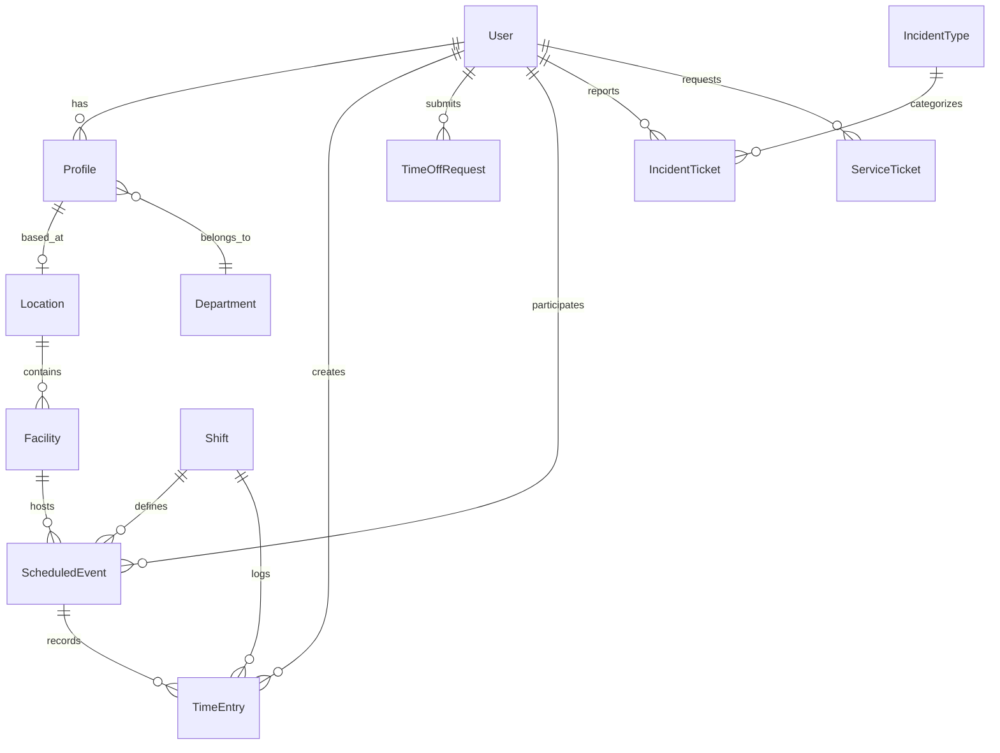

# Django Models Design

## Overview

This document outlines the database models design for the Broadcast Management System backend. The models are designed to support all the data requirements of the existing frontend application.

## Database Schema



## Model Definitions

### User Authentication and Profile Models

```python
from django.db import models
from django.contrib.auth.models import AbstractUser, Group, Permission
from django.utils.translation import gettext_lazy as _

class User(AbstractUser):
    """Custom user model to extend the default Django User"""
    email = models.EmailField(_('email address'), unique=True)
    
    # Additional fields
    is_active_directory = models.BooleanField(default=False)
    last_login_ip = models.GenericIPAddressField(null=True, blank=True)
    
    # Required for custom user model
    groups = models.ManyToManyField(
        Group,
        verbose_name=_('groups'),
        blank=True,
        related_name='broadcast_users',
        help_text=_(
            'The groups this user belongs to. A user will get all permissions '
            'granted to each of their groups.'
        ),
    )
    user_permissions = models.ManyToManyField(
        Permission,
        verbose_name=_('user permissions'),
        blank=True,
        related_name='broadcast_users',
        help_text=_('Specific permissions for this user.'),
    )
    
    def __str__(self):
        return self.username

class Department(models.Model):
    """Department model for organizing users"""
    name = models.CharField(max_length=100)
    description = models.TextField(blank=True)
    manager = models.ForeignKey(
        User, 
        on_delete=models.SET_NULL, 
        null=True, 
        blank=True,
        related_name='managed_departments'
    )
    
    def __str__(self):
        return self.name

class Location(models.Model):
    """Physical location model"""
    name = models.CharField(max_length=100)
    address = models.TextField()
    city = models.CharField(max_length=100)
    state = models.CharField(max_length=100)
    postal_code = models.CharField(max_length=20)
    country = models.CharField(max_length=100)
    phone = models.CharField(max_length=20, blank=True)
    is_active = models.BooleanField(default=True)
    
    def __str__(self):
        return self.name

class Profile(models.Model):
    """Extended user profile information"""
    user = models.OneToOneField(User, on_delete=models.CASCADE, related_name='profile')
    title = models.CharField(max_length=100, blank=True)
    department = models.ForeignKey(
        Department, 
        on_delete=models.SET_NULL, 
        null=True, 
        blank=True,
        related_name='profiles'
    )
    phone = models.CharField(max_length=20, blank=True)
    location = models.ForeignKey(
        Location, 
        on_delete=models.SET_NULL, 
        null=True, 
        blank=True,
        related_name='profiles'
    )
    employee_id = models.CharField(max_length=50, blank=True)
    hire_date = models.DateField(null=True, blank=True)
    profile_image = models.ImageField(upload_to='profiles/', null=True, blank=True)
    emergency_contact = models.TextField(blank=True)
    notes = models.TextField(blank=True)
    
    def __str__(self):
        return f"{self.user.username}'s profile"
```

### Facility and Equipment Models

```python
class Facility(models.Model):
    """Facility model for buildings or areas within a location"""
    name = models.CharField(max_length=100)
    location = models.ForeignKey(
        Location, 
        on_delete=models.CASCADE,
        related_name='facilities'
    )
    description = models.TextField(blank=True)
    capacity = models.IntegerField(null=True, blank=True)
    is_active = models.BooleanField(default=True)
    
    class Meta:
        verbose_name_plural = "facilities"
    
    def __str__(self):
        return f"{self.name} at {self.location.name}"

class EquipmentCategory(models.Model):
    """Equipment category model"""
    name = models.CharField(max_length=100)
    description = models.TextField(blank=True)
    
    class Meta:
        verbose_name_plural = "equipment categories"
    
    def __str__(self):
        return self.name

class Equipment(models.Model):
    """Equipment model for tracking broadcast equipment"""
    name = models.CharField(max_length=100)
    category = models.ForeignKey(
        EquipmentCategory, 
        on_delete=models.SET_NULL, 
        null=True,
        related_name='equipment'
    )
    serial_number = models.CharField(max_length=100, blank=True)
    facility = models.ForeignKey(
        Facility, 
        on_delete=models.SET_NULL, 
        null=True, 
        blank=True,
        related_name='equipment'
    )
    status = models.CharField(
        max_length=20,
        choices=[
            ('available', 'Available'),
            ('in_use', 'In Use'),
            ('maintenance', 'Maintenance'),
            ('retired', 'Retired'),
        ],
        default='available'
    )
    purchase_date = models.DateField(null=True, blank=True)
    notes = models.TextField(blank=True)
    last_maintenance = models.DateField(null=True, blank=True)
    
    def __str__(self):
        return self.name
```

### Scheduling Models

```python
class Shift(models.Model):
    """Shift model for defining work periods"""
    name = models.CharField(max_length=100)
    start_time = models.TimeField()
    end_time = models.TimeField()
    description = models.TextField(blank=True)
    is_active = models.BooleanField(default=True)
    color = models.CharField(max_length=20, blank=True)  # For UI display
    
    def __str__(self):
        return self.name

class ScheduledEvent(models.Model):
    """Scheduled event model for broadcast activities"""
    title = models.CharField(max_length=200)
    description = models.TextField(blank=True)
    start_time = models.DateTimeField()
    end_time = models.DateTimeField()
    shift = models.ForeignKey(
        Shift, 
        on_delete=models.SET_NULL, 
        null=True, 
        blank=True,
        related_name='events'
    )
    facility = models.ForeignKey(
        Facility, 
        on_delete=models.SET_NULL, 
        null=True, 
        blank=True,
        related_name='events'
    )
    participants = models.ManyToManyField(
        User,
        related_name='scheduled_events',
        blank=True
    )
    is_recurring = models.BooleanField(default=False)
    recurrence_pattern = models.JSONField(null=True, blank=True)  # Stores recurrence info
    status = models.CharField(
        max_length=20,
        choices=[
            ('scheduled', 'Scheduled'),
            ('in_progress', 'In Progress'),
            ('completed', 'Completed'),
            ('cancelled', 'Cancelled'),
        ],
        default='scheduled'
    )
    equipment = models.ManyToManyField(
        Equipment,
        related_name='scheduled_events',
        blank=True
    )
    created_by = models.ForeignKey(
        User,
        on_delete=models.SET_NULL,
        null=True,
        related_name='created_events'
    )
    created_at = models.DateTimeField(auto_now_add=True)
    updated_at = models.DateTimeField(auto_now=True)
    
    def __str__(self):
        return self.title

class TimeEntry(models.Model):
    """Time entry model for tracking work hours"""
    user = models.ForeignKey(
        User,
        on_delete=models.CASCADE,
        related_name='time_entries'
    )
    date = models.DateField()
    start_time = models.TimeField()
    end_time = models.TimeField(null=True, blank=True)
    shift = models.ForeignKey(
        Shift, 
        on_delete=models.SET_NULL, 
        null=True, 
        blank=True,
        related_name='time_entries'
    )
    scheduled_event = models.ForeignKey(
        ScheduledEvent,
        on_delete=models.SET_NULL,
        null=True,
        blank=True,
        related_name='time_entries'
    )
    notes = models.TextField(blank=True)
    status = models.CharField(
        max_length=20,
        choices=[
            ('pending', 'Pending'),
            ('approved', 'Approved'),
            ('rejected', 'Rejected'),
        ],
        default='pending'
    )
    approved_by = models.ForeignKey(
        User,
        on_delete=models.SET_NULL,
        null=True,
        blank=True,
        related_name='approved_time_entries'
    )
    created_at = models.DateTimeField(auto_now_add=True)
    updated_at = models.DateTimeField(auto_now=True)
    
    class Meta:
        verbose_name_plural = "time entries"
    
    def __str__(self):
        return f"{self.user.username} - {self.date} {self.start_time}"

class TimeOffRequest(models.Model):
    """Time off request model"""
    user = models.ForeignKey(
        User,
        on_delete=models.CASCADE,
        related_name='time_off_requests'
    )
    start_date = models.DateField()
    end_date = models.DateField()
    reason = models.TextField()
    type = models.CharField(
        max_length=20,
        choices=[
            ('vacation', 'Vacation'),
            ('sick', 'Sick Leave'),
            ('personal', 'Personal'),
            ('other', 'Other'),
        ],
        default='vacation'
    )
    status = models.CharField(
        max_length=20,
        choices=[
            ('pending', 'Pending'),
            ('approved', 'Approved'),
            ('rejected', 'Rejected'),
        ],
        default='pending'
    )
    approved_by = models.ForeignKey(
        User,
        on_delete=models.SET_NULL,
        null=True,
        blank=True,
        related_name='approved_time_off_requests'
    )
    created_at = models.DateTimeField(auto_now_add=True)
    updated_at = models.DateTimeField(auto_now=True)
    
    def __str__(self):
        return f"{self.user.username} - {self.start_date} to {self.end_date}"
```

### Ticket Management Models

```python
class IncidentType(models.Model):
    """Incident type categorization"""
    name = models.CharField(max_length=100)
    description = models.TextField(blank=True)
    severity_level = models.IntegerField(default=3)  # 1-5 scale, 1 being highest
    is_active = models.BooleanField(default=True)
    
    def __str__(self):
        return self.name

class IncidentTicket(models.Model):
    """Incident ticket model for issues and problems"""
    title = models.CharField(max_length=200)
    description = models.TextField()
    incident_type = models.ForeignKey(
        IncidentType,
        on_delete=models.SET_NULL,
        null=True,
        related_name='tickets'
    )
    reporter = models.ForeignKey(
        User,
        on_delete=models.SET_NULL,
        null=True,
        related_name='reported_incidents'
    )
    assigned_to = models.ForeignKey(
        User,
        on_delete=models.SET_NULL,
        null=True,
        blank=True,
        related_name='assigned_incidents'
    )
    facility = models.ForeignKey(
        Facility,
        on_delete=models.SET_NULL,
        null=True,
        blank=True,
        related_name='incidents'
    )
    equipment = models.ForeignKey(
        Equipment,
        on_delete=models.SET_NULL,
        null=True,
        blank=True,
        related_name='incidents'
    )
    priority = models.CharField(
        max_length=20,
        choices=[
            ('low', 'Low'),
            ('medium', 'Medium'),
            ('high', 'High'),
            ('critical', 'Critical'),
        ],
        default='medium'
    )
    status = models.CharField(
        max_length=20,
        choices=[
            ('new', 'New'),
            ('in_progress', 'In Progress'),
            ('on_hold', 'On Hold'),
            ('resolved', 'Resolved'),
            ('closed', 'Closed'),
        ],
        default='new'
    )
    resolution = models.TextField(blank=True)
    created_at = models.DateTimeField(auto_now_add=True)
    updated_at = models.DateTimeField(auto_now=True)
    resolved_at = models.DateTimeField(null=True, blank=True)
    
    def __str__(self):
        return self.title

class ServiceTicket(models.Model):
    """Service ticket model for requests and changes"""
    title = models.CharField(max_length=200)
    description = models.TextField()
    requester = models.ForeignKey(
        User,
        on_delete=models.SET_NULL,
        null=True,
        related_name='requested_services'
    )
    assigned_to = models.ForeignKey(
        User,
        on_delete=models.SET_NULL,
        null=True,
        blank=True,
        related_name='assigned_services'
    )
    facility = models.ForeignKey(
        Facility,
        on_delete=models.SET_NULL,
        null=True,
        blank=True,
        related_name='service_tickets'
    )
    equipment = models.ForeignKey(
        Equipment,
        on_delete=models.SET_NULL,
        null=True,
        blank=True,
        related_name='service_tickets'
    )
    service_type = models.CharField(
        max_length=20,
        choices=[
            ('request', 'Request'),
            ('change', 'Change'),
            ('information', 'Information'),
        ],
        default='request'
    )
    priority = models.CharField(
        max_length=20,
        choices=[
            ('low', 'Low'),
            ('medium', 'Medium'),
            ('high', 'High'),
        ],
        default='medium'
    )
    status = models.CharField(
        max_length=20,
        choices=[
            ('new', 'New'),
            ('in_progress', 'In Progress'),
            ('on_hold', 'On Hold'),
            ('completed', 'Completed'),
            ('cancelled', 'Cancelled'),
        ],
        default='new'
    )
    requested_completion_date = models.DateField(null=True, blank=True)
    completion_notes = models.TextField(blank=True)
    created_at = models.DateTimeField(auto_now_add=True)
    updated_at = models.DateTimeField(auto_now=True)
    completed_at = models.DateTimeField(null=True, blank=True)
    
    def __str__(self):
        return self.title
```

### Communication and Notification Models

```python
class Comment(models.Model):
    """Comment model for tickets and events"""
    text = models.TextField()
    user = models.ForeignKey(
        User,
        on_delete=models.CASCADE,
        related_name='comments'
    )
    created_at = models.DateTimeField(auto_now_add=True)
    updated_at = models.DateTimeField(auto_now=True)
    
    # Generic Foreign Key setup
    content_type = models.ForeignKey(ContentType, on_delete=models.CASCADE)
    object_id = models.PositiveIntegerField()
    content_object = GenericForeignKey('content_type', 'object_id')
    
    def __str__(self):
        return f"Comment by {self.user.username} on {self.created_at}"

class Notification(models.Model):
    """Notification model for system alerts"""
    user = models.ForeignKey(
        User,
        on_delete=models.CASCADE,
        related_name='notifications'
    )
    title = models.CharField(max_length=100)
    message = models.TextField()
    is_read = models.BooleanField(default=False)
    notification_type = models.CharField(
        max_length=20,
        choices=[
            ('info', 'Information'),
            ('warning', 'Warning'),
            ('alert', 'Alert'),
        ],
        default='info'
    )
    
    # Generic Foreign Key for the object the notification refers to
    content_type = models.ForeignKey(ContentType, on_delete=models.CASCADE, null=True, blank=True)
    object_id = models.PositiveIntegerField(null=True, blank=True)
    content_object = GenericForeignKey('content_type', 'object_id')
    
    created_at = models.DateTimeField(auto_now_add=True)
    
    def __str__(self):
        return f"{self.title} for {self.user.username}"
```

### Audit and Logging Models

```python
class AuditLog(models.Model):
    """Audit log for system activities"""
    user = models.ForeignKey(
        User,
        on_delete=models.SET_NULL,
        null=True,
        related_name='audit_logs'
    )
    action = models.CharField(max_length=100)
    details = models.JSONField()
    ip_address = models.GenericIPAddressField(null=True, blank=True)
    user_agent = models.TextField(blank=True)
    
    # Generic Foreign Key for the affected object
    content_type = models.ForeignKey(ContentType, on_delete=models.CASCADE, null=True, blank=True)
    object_id = models.PositiveIntegerField(null=True, blank=True)
    content_object = GenericForeignKey('content_type', 'object_id')
    
    created_at = models.DateTimeField(auto_now_add=True)
    
    def __str__(self):
        return f"{self.action} by {self.user} at {self.created_at}"
```

## Model Serializers

Django REST Framework serializers will be created for each model to facilitate API responses. Below is an example of the serializers structure:

```python
# serializers.py
from rest_framework import serializers
from .models import User, Profile, Location, Facility, Shift, IncidentTicket, ServiceTicket

class UserSerializer(serializers.ModelSerializer):
    class Meta:
        model = User
        fields = ['id', 'username', 'email', 'first_name', 'last_name', 'is_active']
        read_only_fields = ['id']

class ProfileSerializer(serializers.ModelSerializer):
    user = UserSerializer(read_only=True)
    
    class Meta:
        model = Profile
        fields = ['id', 'user', 'title', 'department', 'phone', 'location', 
                 'employee_id', 'hire_date', 'profile_image', 'emergency_contact']
        read_only_fields = ['id']

class LocationSerializer(serializers.ModelSerializer):
    class Meta:
        model = Location
        fields = ['id', 'name', 'address', 'city', 'state', 'postal_code', 
                 'country', 'phone', 'is_active']
        read_only_fields = ['id']

class FacilitySerializer(serializers.ModelSerializer):
    location_name = serializers.CharField(source='location.name', read_only=True)
    
    class Meta:
        model = Facility
        fields = ['id', 'name', 'location', 'location_name', 'description', 
                 'capacity', 'is_active']
        read_only_fields = ['id', 'location_name']
```

## Database Migrations

Django migrations will be used to create and maintain the database schema. The initial migrations will create all the necessary tables and relationships.

```bash
# Generate initial migrations
python manage.py makemigrations

# Apply migrations to database
python manage.py migrate
```

## Data Seeding

Initial data for development and testing can be created using Django fixtures or custom management commands.

```python
# Example management command for creating initial data
from django.core.management.base import BaseCommand
from django.contrib.auth import get_user_model
from ...models import Location, Facility, Department, Shift

User = get_user_model()

class Command(BaseCommand):
    help = 'Seeds the database with initial data'

    def handle(self, *args, **kwargs):
        # Create superuser
        if not User.objects.filter(username='admin').exists():
            User.objects.create_superuser('admin', 'admin@example.com', 'adminpassword')
            self.stdout.write(self.style.SUCCESS('Superuser created'))
            
        # Create locations
        if not Location.objects.exists():
            locations = [
                {'name': 'Main Studio', 'city': 'New York', 'state': 'NY'},
                {'name': 'Remote Office', 'city': 'Los Angeles', 'state': 'CA'},
            ]
            for loc_data in locations:
                Location.objects.create(
                    name=loc_data['name'],
                    address='123 Broadcast St.',
                    city=loc_data['city'],
                    state=loc_data['state'],
                    postal_code='10001',
                    country='USA'
                )
            self.stdout.write(self.style.SUCCESS('Locations created'))
            
        # Create more seed data for other models...
```

## Database Indexes

To optimize query performance, indexes will be added to frequently queried fields:

```python
class ScheduledEvent(models.Model):
    # ... fields ...
    
    class Meta:
        indexes = [
            models.Index(fields=['start_time', 'end_time']),
            models.Index(fields=['status']),
        ]

class TimeEntry(models.Model):
    # ... fields ...
    
    class Meta:
        indexes = [
            models.Index(fields=['user', 'date']),
            models.Index(fields=['status']),
        ]
```

## Permissions and Access Control

Django's permission system will be used to control access to model data. Custom permissions will be defined as needed:

```python
class IncidentTicket(models.Model):
    # ... fields ...
    
    class Meta:
        permissions = [
            ("close_incident", "Can close incident tickets"),
            ("assign_incident", "Can assign incident tickets to users"),
        ]
```

## Conclusion

This model design provides a comprehensive foundation for the Broadcast Management System backend. The models are structured to support the existing frontend application while allowing for future expansion of features. The use of Django's ORM provides flexibility in handling database operations and migrations, making it easier to evolve the schema as requirements change. 