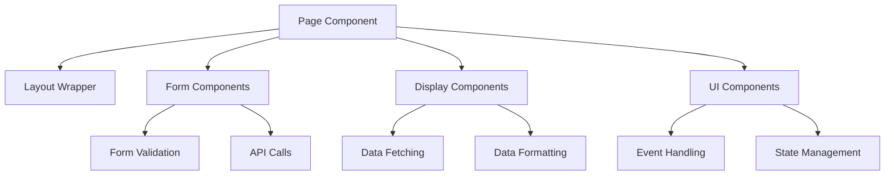
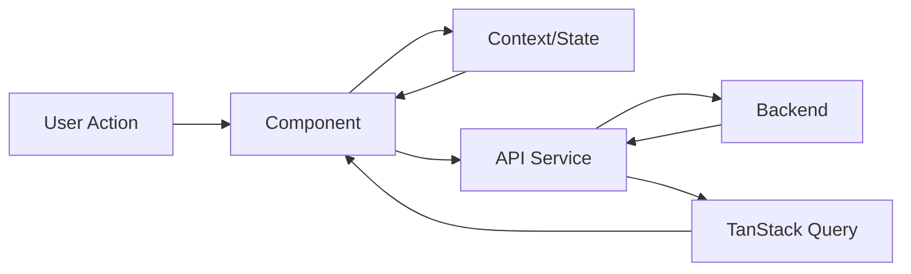
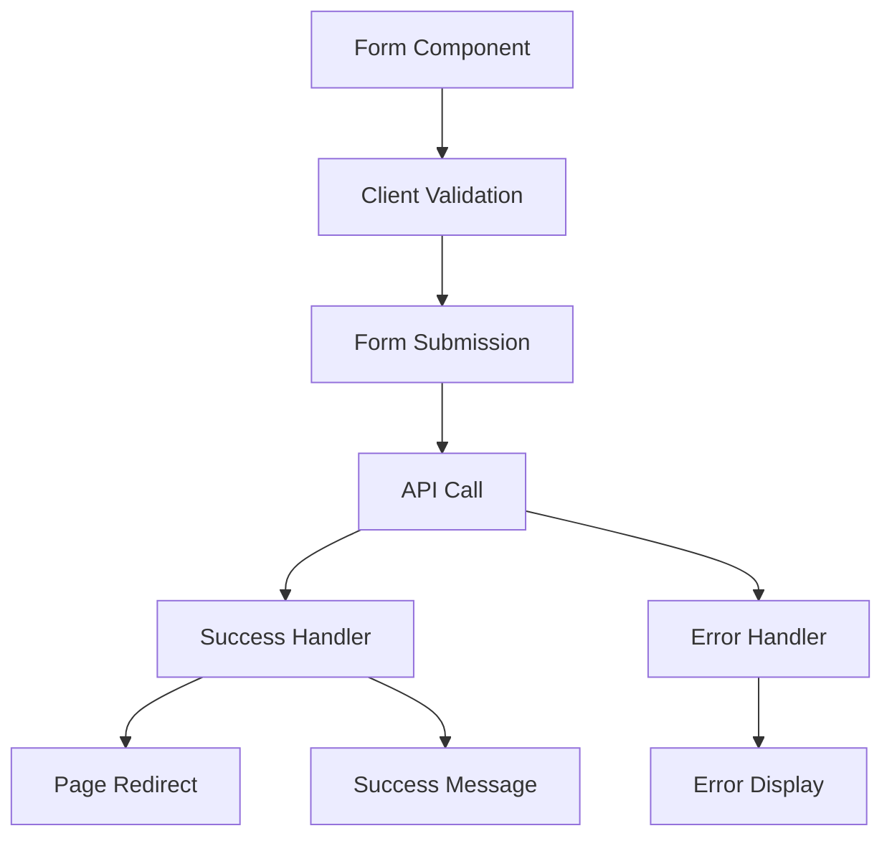

# Component Overview

This document provides a comprehensive analysis of all React components in the Broadcast Management System frontend application. Components are organized by category and analyzed for their functionality, dependencies, and integration patterns.

## Component Categories

### 1. Layout Components
### 2. Page Components  
### 3. Form Components
### 4. Data Display Components
### 5. UI Components
### 6. Utility Components

---

## 1. Layout Components

### Layout.tsx
**Purpose**: Main application layout wrapper providing consistent structure across all pages.

**Key Features**:
- Responsive sidebar layout with header
- User authentication display
- Logout functionality
- Notification icon placeholder
- Main content area wrapper

**Dependencies**: 
- `@/components/ui/sidebar` - Sidebar components
- `@/contexts/AuthContext` - Authentication state
- `Sidebar.tsx` - Navigation sidebar

**Props Interface**:
```typescript
interface LayoutProps {
  children: React.ReactNode;
}
```

**Usage Pattern**:
```typescript
<Layout>
  <Dashboard />
</Layout>
```

### Sidebar.tsx (AppSidebar)
**Purpose**: Navigation sidebar with role-based menu items and collapsible functionality.

**Key Features**:
- Collapsible navigation menu
- Role-based menu item visibility
- Active route highlighting
- Grouped menu sections (Main, Engineering, Management, etc.)
- Responsive design

**Menu Structure**:
- **Main**: Dashboard, Time Keeping, Schedule, Reports
- **Operations**: Incident Report, Change Request, System Check
- **Engineering**: Engineering Dashboard, Service Tickets, Incident Tickets  
- **Management**: Management Dashboard, Analytics, Employee Management
- **Settings**: Application settings

**Dependencies**:
- `@/components/ui/sidebar` - Sidebar primitives
- `react-router-dom` - Navigation and active route detection
- `lucide-react` - Icons

### ProtectedRoute.tsx
**Purpose**: Authentication wrapper for protecting routes from unauthorized access.

**Key Features**:
- Authentication state checking
- Automatic redirect to login for unauthenticated users
- Loading state handling

**Usage**:
```typescript
<ProtectedRoute>
  <Layout>
    <Dashboard />
  </Layout>
</ProtectedRoute>
```

---

## 2. Page Components

### Dashboard.tsx
**Purpose**: Main dashboard providing overview of broadcast operations and quick access to key functions.

**Key Features**:
- Week view of scheduled events
- Staffing status indicators
- Quick action buttons
- Stats cards (Total Events, Active Staff, Pending Approvals)
- Recent activity feed
- Responsive grid layout

**Data Structures**:
```typescript
interface Event {
  name: string;
  staffed: boolean;
}

interface DaySchedule {
  date: string;
  day: string;
  isToday: boolean;
  events: Event[];
}
```

### TimeKeeping.tsx
**Purpose**: Time tracking interface for employee clock-in/out and timesheet management.

**Key Features**:
- Digital clock display
- Clock in/out functionality
- Break time tracking
- Current week timesheet view
- Time entry validation
- Manager approval workflow

**Component Dependencies**:
- `ClockEntryForm.tsx`
- `MonthlyTimeCalendar.tsx`
- `TimeClockApproval.tsx`

### Scheduling.tsx
**Purpose**: Event and shift scheduling interface with calendar view and conflict detection.

**Key Features**:
- Calendar-based event scheduling
- Drag-and-drop functionality
- Conflict detection and resolution
- Recurring event support
- Staff assignment interface
- Schedule templates

**Dependencies**:
- Date manipulation utilities
- Calendar components
- Form validation

### EmployeeManagement.tsx
**Purpose**: User and profile management interface for administrators.

**Key Features**:
- Employee list with search and filtering
- Add/edit employee functionality
- Role assignment
- Department management
- Profile status tracking

**Related Components**:
- `AddEmployeeDialog.tsx`
- `EmployeeDetail.tsx`

### Reports.tsx
**Purpose**: Data visualization and reporting interface with export capabilities.

**Key Features**:
- Multiple report types (Time, Scheduling, Incidents)
- Date range selection
- Export functionality (PDF, Excel, CSV)
- Chart and graph displays
- Filter and search capabilities

### Settings.tsx
**Purpose**: System configuration interface for administrators.

**Key Features**:
- Location and facility management
- Shift configuration
- Incident type setup
- User role management
- System preferences
- Backup and maintenance options

**Related Components**:
- `ManagementSettings.tsx`
- Form components for various settings

---

## 3. Form Components

### ClockEntryForm.tsx
**Purpose**: Time clock interface for employee check-in/out with validation.

**Key Features**:
- Real-time clock display
- Clock in/out buttons with validation
- Break time tracking
- Location selection
- Notes and comments
- Automatic time calculations

**Form Validation**:
- Prevents double clock-in
- Validates break times
- Enforces location selection
- Handles edge cases (overnight shifts)

### EnhancedClockEntryForm.tsx
**Purpose**: Advanced time entry form with additional features and validation.

**Key Features**:
- Enhanced validation rules
- Overtime detection
- Multi-location support
- Advanced break tracking
- Historical time entry editing

### TimeOffRequestForm.tsx
**Purpose**: Time-off request submission form with approval workflow.

**Key Features**:
- Date range selection
- Request type categorization
- Reason/notes input
- Manager assignment
- Status tracking
- Conflict checking with scheduled events

**Form Fields**:
```typescript
interface TimeOffRequest {
  startDate: Date;
  endDate: Date;
  requestType: 'vacation' | 'sick' | 'personal' | 'other';
  reason: string;
  manager?: string;
}
```

### AddEmployeeDialog.tsx
**Purpose**: Modal dialog for adding new employees to the system.

**Key Features**:
- Multi-step form wizard
- Employee information validation
- Role and department assignment
- Profile image upload
- Duplicate detection

---

## 4. Data Display Components

### TicketDetail.tsx
**Purpose**: Comprehensive ticket information display with status tracking and actions.

**Key Features**:
- Detailed ticket information display
- Status timeline and history
- Comment and update tracking
- File attachment support
- Action buttons (assign, update, close)
- Related ticket suggestions

**Supported Ticket Types**:
- Incident tickets
- Service requests
- Change requests

### MonthlyTimeCalendar.tsx
**Purpose**: Calendar view for time entries with visual status indicators.

**Key Features**:
- Monthly calendar layout
- Time entry status visualization
- Daily hour totals
- Color-coded status indicators
- Navigation between months
- Click-to-edit functionality

**Status Indicators**:
- ✅ Approved entries
- ⏳ Pending approval
- ❌ Rejected entries
- ⚠️ Missing entries

### TimeClockApproval.tsx
**Purpose**: Manager interface for reviewing and approving time entries.

**Key Features**:
- Bulk approval functionality
- Individual time entry review
- Rejection with comments
- Filter and search capabilities
- Department-based filtering
- Export functionality

### TicketReview.tsx
**Purpose**: Ticket review and approval interface for managers.

**Key Features**:
- Ticket queue management
- Priority-based sorting
- Bulk operations
- Comment and status updates
- Assignment management
- SLA tracking

---

## 5. UI Components (shadcn/ui)

### Core UI Components
The application uses shadcn/ui components for consistent design:

#### Button Components
- **Button**: Primary action buttons with variants
- **Toggle**: Binary state toggles
- **Switch**: On/off switches

#### Input Components
- **Input**: Text input fields
- **Textarea**: Multi-line text input
- **Select**: Dropdown selection
- **Checkbox**: Boolean input
- **RadioGroup**: Single selection from options

#### Layout Components
- **Card**: Content containers with header/footer
- **Separator**: Visual dividers
- **ScrollArea**: Scrollable content areas
- **Tabs**: Tabbed content organization

#### Overlay Components
- **Dialog**: Modal dialogs
- **Sheet**: Slide-over panels
- **Popover**: Contextual popups
- **Tooltip**: Hover information
- **AlertDialog**: Confirmation dialogs

#### Data Display
- **Table**: Data tables with sorting/filtering
- **Badge**: Status and category indicators
- **Avatar**: User profile images
- **Progress**: Progress indicators

#### Navigation
- **Sidebar**: Navigation sidebar components
- **Breadcrumb**: Navigation breadcrumbs
- **Pagination**: Page navigation

### Custom UI Extensions
The application extends base UI components with domain-specific functionality:

#### Enhanced Components
- **DataTable**: Tables with advanced filtering, sorting, and pagination
- **DatePicker**: Calendar-based date selection
- **TimeInput**: Time selection components
- **StatusBadge**: Custom status indicators
- **UserAvatar**: User profile display

---

## 6. Utility Components

### Component Utilities
Several utility components provide cross-cutting functionality:

#### Error Handling
- **ErrorBoundary**: React error boundary for component errors
- **ErrorDisplay**: User-friendly error messages
- **LoadingSpinner**: Loading state indicators

#### Data Management
- **DataProvider**: Context-based data management
- **QueryWrapper**: TanStack Query integration
- **FormProvider**: Form state management

---

## Component Interaction Patterns

### 1. Page-Component Relationship


### 2. State Flow


### 3. Form Workflow


## Component Dependencies

### External Dependencies
- **React 18**: Core component framework
- **React Router**: Navigation and routing
- **React Hook Form**: Form state management
- **TanStack Query**: Data fetching and caching
- **Zod**: Form validation
- **date-fns**: Date manipulation
- **Lucide React**: Icon library

### Internal Dependencies
- **UI Components**: shadcn/ui component library
- **Contexts**: AuthContext, SettingsContext
- **Services**: API service layer
- **Types**: TypeScript type definitions
- **Utils**: Utility functions and helpers

## Performance Considerations

### Optimization Strategies
1. **Lazy Loading**: Route-based code splitting
2. **Memoization**: React.memo for expensive renders
3. **Virtual Scrolling**: Large data set handling
4. **Query Optimization**: Intelligent caching with TanStack Query
5. **Bundle Splitting**: Webpack code splitting

### Component Size Analysis
- **Large Components** (>500 lines): Settings.tsx, EmployeeDetail.tsx, TicketDetail.tsx
- **Medium Components** (200-500 lines): Dashboard.tsx, TimeKeeping.tsx, Scheduling.tsx
- **Small Components** (<200 lines): Form components, UI components

## Testing Strategy

### Component Testing
- **Unit Tests**: Individual component functionality
- **Integration Tests**: Component interaction testing
- **Accessibility Tests**: Screen reader and keyboard navigation
- **Visual Tests**: UI consistency and responsiveness

### Testing Tools
- **React Testing Library**: Component behavior testing
- **Jest**: Test runner and assertions
- **MSW**: API mocking for tests
- **Storybook**: Component documentation and testing

## Future Enhancements

### Planned Improvements
1. **Component Library**: Extract reusable components
2. **Performance**: Virtualization for large datasets
3. **Accessibility**: Enhanced ARIA support
4. **Mobile**: Progressive Web App features
5. **Offline**: Service worker integration 