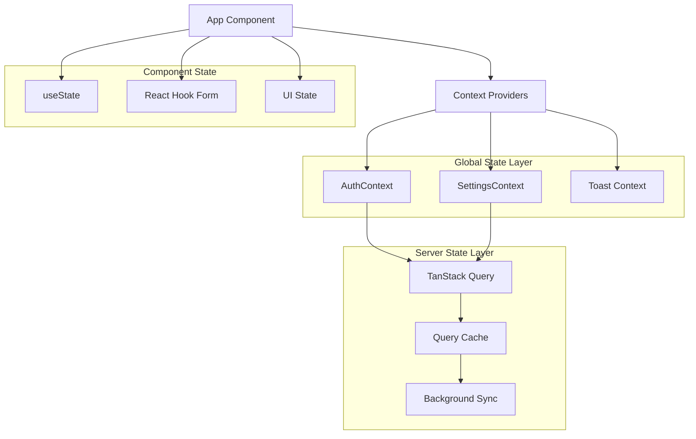

# Context & State Management

This document covers the state management architecture in the Broadcast Management System frontend, including React Context patterns, custom hooks, and state synchronization strategies.

## Overview

The application uses a layered state management approach combining React Context for global application state with TanStack Query for server state management. This provides a clean separation between local application state and server-synchronized data.

## Architecture



## Context Providers

### AuthContext
Manages user authentication state and profile information.

```typescript
interface AuthContextType {
  user: DjangoUser | null;          // Current authenticated user
  profile: Profile | null;          // User's profile information
  isLoading: boolean;               // Authentication loading state
  login: (username: string, password: string) => Promise<boolean>;
  logout: () => Promise<void>;
  refreshUser: () => Promise<void>; // Refresh user data
}
```

**Key Features**:
- **Session Persistence**: Automatically checks for existing sessions on app load
- **Profile Integration**: Fetches user profile data alongside authentication
- **Toast Integration**: User feedback for login/logout actions
- **Error Handling**: Graceful handling of authentication failures
- **State Synchronization**: Keeps user and profile data in sync

**Usage Pattern**:
```typescript
const { user, profile, login, logout, isLoading } = useAuth();

// Login
const handleLogin = async () => {
  const success = await login(username, password);
  if (success) {
    navigate('/dashboard');
  }
};

// Logout
const handleLogout = async () => {
  await logout();
  navigate('/login');
};
```

**Implementation Details**:
```typescript
export const AuthProvider = ({ children }: { children: React.ReactNode }) => {
  const [user, setUser] = useState<DjangoUser | null>(null);
  const [profile, setProfile] = useState<Profile | null>(null);
  const [isLoading, setIsLoading] = useState(true);
  
  const refreshUser = async () => {
    try {
      const currentUser = await djangoApi.getCurrentUser();
      setUser(currentUser);
      
      // Get user profile
      const profiles = await djangoApi.getProfiles();
      const userProfile = profiles.results?.find(p => p.user.id === currentUser.id);
      setProfile(userProfile || null);
    } catch (error) {
      setUser(null);
      setProfile(null);
    } finally {
      setIsLoading(false);
    }
  };
  
  // Check for existing session on mount
  useEffect(() => {
    refreshUser();
  }, []);
  
  // ... login, logout implementation
};
```

### SettingsContext
Manages application configuration data including locations, facilities, shifts, and incident types.

```typescript
interface SettingsContextType {
  locations: Location[];           // Available locations
  shifts: Shift[];                // Defined work shifts
  facilities: Facility[];         // Facility information
  incidentTypes: IncidentType[];  // Incident categorization
  getScheduledEvents: (date: string) => Promise<ScheduledEvent[]>;
  refreshData: () => Promise<void>; // Reload all settings data
  isLoading: boolean;              // Settings loading state
}
```

**Key Features**:
- **Parallel Data Loading**: Efficiently loads all settings data concurrently
- **Error Resilience**: Continues operation even if some settings fail to load
- **Event Filtering**: Provides date-based event filtering functionality
- **Cache Management**: Handles data refresh and cache invalidation
- **Performance Optimization**: Loads settings once and shares across components

**Usage Pattern**:
```typescript
const { locations, facilities, shifts, incidentTypes, isLoading } = useSettings();

// Use in form components
<Select>
  {locations.map(location => (
    <SelectItem key={location.id} value={location.id.toString()}>
      {location.name}
    </SelectItem>
  ))}
</Select>
```

**Implementation Details**:
```typescript
export const SettingsProvider = ({ children }: { children: React.ReactNode }) => {
  const [locations, setLocations] = useState<Location[]>([]);
  const [shifts, setShifts] = useState<Shift[]>([]);
  const [facilities, setFacilities] = useState<Facility[]>([]);
  const [incidentTypes, setIncidentTypes] = useState<IncidentType[]>([]);
  const [isLoading, setIsLoading] = useState(true);

  const refreshData = async () => {
    try {
      setIsLoading(true);
      const [locationsRes, shiftsRes, facilitiesRes, incidentTypesRes] = await Promise.all([
        djangoApi.getLocations(),
        djangoApi.getShifts(),
        djangoApi.getFacilities(),
        djangoApi.getIncidentTypes(),
      ]);

      setLocations(locationsRes.results || []);
      setShifts(shiftsRes.results || []);
      setFacilities(facilitiesRes.results || []);
      setIncidentTypes(incidentTypesRes.results || []);
    } catch (error) {
      console.error('Failed to load settings data:', error);
    } finally {
      setIsLoading(false);
    }
  };
  
  // Load settings on mount
  useEffect(() => {
    refreshData();
  }, []);
};
```

## Server State Management

### TanStack Query Integration
The application uses TanStack Query for efficient server state management, providing caching, background updates, and optimistic updates.

**Configuration**:
```typescript
const queryClient = new QueryClient({
  defaultOptions: {
    queries: {
      staleTime: 5 * 60 * 1000,        // 5 minutes
      cacheTime: 10 * 60 * 1000,       // 10 minutes
      retry: 3,                         // Retry failed requests
      refetchOnWindowFocus: false,      // Disable refetch on focus
    },
  },
});
```

**Query Patterns**:
```typescript
// List queries with pagination
const useIncidentTickets = () => {
  return useQuery({
    queryKey: ['incident-tickets'],
    queryFn: () => djangoApi.getIncidentTickets(),
    staleTime: 5 * 60 * 1000,
  });
};

// Detail queries with parameters
const useIncidentTicket = (id: number) => {
  return useQuery({
    queryKey: ['incident-tickets', id],
    queryFn: () => djangoApi.getIncidentTicket(id),
    enabled: !!id, // Only run if id is provided
  });
};

// Mutation with optimistic updates
const useCreateIncidentTicket = () => {
  const queryClient = useQueryClient();
  
  return useMutation({
    mutationFn: (data: Partial<IncidentTicket>) => 
      djangoApi.createIncidentTicket(data),
    onSuccess: () => {
      // Invalidate and refetch
      queryClient.invalidateQueries(['incident-tickets']);
    },
  });
};
```

## Custom Hooks

### useAuth Hook
Provides access to authentication context with type safety.

```typescript
export const useAuth = () => {
  const context = useContext(AuthContext);
  if (!context) {
    throw new Error('useAuth must be used within an AuthProvider');
  }
  return context;
};
```

### useSettings Hook
Provides access to settings context with type safety.

```typescript
export const useSettings = () => {
  const context = useContext(SettingsContext);
  if (!context) {
    throw new Error('useSettings must be used within a SettingsProvider');
  }
  return context;
};
```

### useToast Hook
Provides toast notification functionality (from shadcn/ui).

```typescript
// Usage
const { toast } = useToast();

toast({
  title: "Success",
  description: "Operation completed successfully",
});

toast({
  title: "Error",
  description: "Something went wrong",
  variant: "destructive",
});
```

### useMobile Hook
Detects mobile device screens for responsive behavior.

```typescript
export function useMobile() {
  const [isMobile, setIsMobile] = useState(false);

  useEffect(() => {
    const checkDevice = () => {
      setIsMobile(window.innerWidth < 768);
    };
    
    checkDevice();
    window.addEventListener('resize', checkDevice);
    
    return () => window.removeEventListener('resize', checkDevice);
  }, []);

  return isMobile;
}
```

## State Synchronization Patterns

### Context + Query Integration
Contexts handle application state while TanStack Query manages server state:

```typescript
// In AuthContext
const login = async (username: string, password: string) => {
  const user = await djangoApi.login(username, password);
  setUser(user); // Update context
  
  // TanStack Query will handle profile data
  queryClient.invalidateQueries(['profiles']);
  return true;
};
```

### Optimistic Updates
For better UX, mutations can update the UI before server confirmation:

```typescript
const useUpdateTimeEntry = () => {
  const queryClient = useQueryClient();
  
  return useMutation({
    mutationFn: ({ id, data }: { id: number, data: Partial<TimeEntry> }) =>
      djangoApi.updateTimeEntry(id, data),
    onMutate: async ({ id, data }) => {
      // Cancel outgoing refetches
      await queryClient.cancelQueries(['time-entries']);
      
      // Snapshot previous value
      const previousEntries = queryClient.getQueryData(['time-entries']);
      
      // Optimistically update
      queryClient.setQueryData(['time-entries'], (old: any) => ({
        ...old,
        results: old.results.map((entry: TimeEntry) => 
          entry.id === id ? { ...entry, ...data } : entry
        )
      }));
      
      return { previousEntries };
    },
    onError: (err, variables, context) => {
      // Rollback on error
      if (context?.previousEntries) {
        queryClient.setQueryData(['time-entries'], context.previousEntries);
      }
    },
    onSettled: () => {
      // Always refetch after error or success
      queryClient.invalidateQueries(['time-entries']);
    },
  });
};
```

## Provider Hierarchy

The application providers are structured in a specific hierarchy for optimal functionality:

```typescript
function App() {
  return (
    <QueryClientProvider client={queryClient}>
      <AuthProvider>
        <TooltipProvider>
          <BrowserRouter>
            <Routes>
              <Route path="/login" element={<Login />} />
              <Route path="/*" element={
                <ProtectedRoute>
                  <Layout>
                    <SettingsProvider>
                      {/* Page components */}
                    </SettingsProvider>
                  </Layout>
                </ProtectedRoute>
              } />
            </Routes>
          </BrowserRouter>
          <Toaster />
          <Sonner />
        </TooltipProvider>
      </AuthProvider>
    </QueryClientProvider>
  );
}
```

**Provider Order Explanation**:
1. **QueryClientProvider**: Must be at the top to provide TanStack Query context
2. **AuthProvider**: Needs Query context for API calls
3. **TooltipProvider**: UI enhancement for tooltips
4. **BrowserRouter**: Routing context for navigation
5. **SettingsProvider**: Nested inside protected routes, needs auth context

## Performance Considerations

### Context Optimization
- **Value Memoization**: Context values are memoized to prevent unnecessary re-renders
- **Selective Re-renders**: Components only re-render when needed context values change
- **Lazy Loading**: Settings are loaded only when needed

### Query Optimization
- **Stale-While-Revalidate**: Data remains available while refreshing in background
- **Intelligent Caching**: Reduces redundant network requests
- **Background Updates**: Keeps data fresh without blocking UI

### Memory Management
- **Cleanup**: Effect cleanup prevents memory leaks
- **Query Garbage Collection**: Automatic cleanup of unused query data
- **Context Cleanup**: Proper context cleanup on unmount

## Error Handling

### Context Error Boundaries
```typescript
class ContextErrorBoundary extends React.Component {
  componentDidCatch(error: Error, errorInfo: ErrorInfo) {
    if (error.message.includes('must be used within')) {
      // Handle context usage errors
      console.error('Context usage error:', error);
    }
  }
}
```

### Query Error Handling
```typescript
const { data, error, isError } = useQuery({
  queryKey: ['data'],
  queryFn: fetchData,
  onError: (error) => {
    toast({
      title: "Error",
      description: error.message,
      variant: "destructive",
    });
  },
});
```

## Testing Strategies

### Context Testing
```typescript
// Test wrapper for contexts
const renderWithContext = (component: React.ReactElement) => {
  return render(
    <QueryClientProvider client={queryClient}>
      <AuthProvider>
        {component}
      </AuthProvider>
    </QueryClientProvider>
  );
};
```

### Mock Providers
```typescript
// Mock context for testing
const MockAuthProvider = ({ children, value }) => (
  <AuthContext.Provider value={value}>
    {children}
  </AuthContext.Provider>
);
```

## Best Practices

### Context Design
- **Single Responsibility**: Each context handles one domain
- **Type Safety**: Full TypeScript integration with proper interfaces
- **Error Boundaries**: Graceful error handling for context usage
- **Performance**: Optimize re-renders with proper dependency management

### State Updates
- **Immutable Updates**: Always create new state objects
- **Async Handling**: Proper loading states for async operations
- **Error States**: Handle and display errors appropriately
- **Optimistic Updates**: Improve perceived performance with optimistic updates

### Developer Experience
- **Clear APIs**: Intuitive hook interfaces
- **Good Defaults**: Sensible default values and configurations
- **Error Messages**: Helpful error messages for debugging
- **Documentation**: Clear usage examples and patterns 