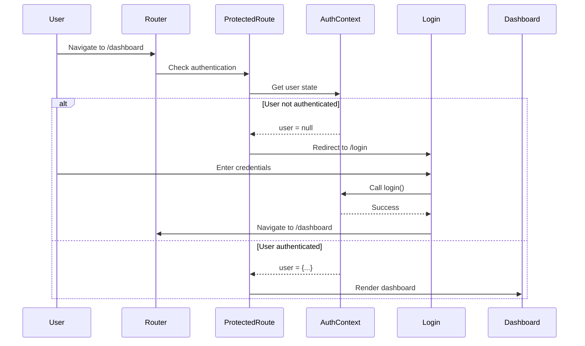

# Routing

This document covers the routing architecture in the Broadcast Management System frontend, including React Router configuration, route protection, navigation patterns, and routing best practices.

## Overview

The application uses React Router v6 for client-side navigation with a comprehensive routing system that includes route protection, nested layouts, and dynamic routing patterns. The routing structure is designed to provide a smooth user experience while maintaining security through authentication-based route protection.

## Routing Architecture

```mermaid
graph TD
    Router[BrowserRouter] --> Routes[Routes Container]
    Routes --> Public[Public Routes]
    Routes --> Protected[Protected Routes]
    
    Public --> Login[/login]
    
    Protected --> ProtectedRoute[ProtectedRoute Wrapper]
    ProtectedRoute --> Layout[Layout Wrapper]
    Layout --> Settings[SettingsProvider]
    Settings --> Pages[Page Components]
    
    subgraph "Main Navigation"
        Dashboard[/ - Dashboard]
        TimeKeeping[/time-keeping]
        Schedule[/schedule]
        Reports[/reports]
    end
    
    subgraph "Operations"
        IncidentReport[/incident-report]
        ChangeRequest[/change-request]
        SystemCheck[/system-check]
    end
    
    subgraph "Management"
        Management[/management]
        Analytics[/analytics]
        Employees[/employees]
        EmployeeDetail[/employees/:id]
        Scheduling[/scheduling]
    end
    
    subgraph "Support"
        Engineering[/engineering]
        ServiceTickets[/service-tickets]
        IncidentTickets[/incident-tickets]
        Settings_Page[/settings]
    end
    
    Pages --> Dashboard
    Pages --> TimeKeeping
    Pages --> Schedule
    Pages --> Reports
    Pages --> IncidentReport
    Pages --> ChangeRequest
    Pages --> SystemCheck
    Pages --> Management
    Pages --> Analytics
    Pages --> Employees
    Pages --> EmployeeDetail
    Pages --> Scheduling
    Pages --> Engineering
    Pages --> ServiceTickets
    Pages --> IncidentTickets
    Pages --> Settings_Page
    
    Protected --> NotFound[/* - 404 Page]
    
    style Protected fill:#4da6ff
    style Public fill:#52c41a
    style ProtectedRoute fill:#ff7875
```

## Route Configuration

### Main App Routes

```typescript
const App = () => {
  return (
    <QueryClientProvider client={queryClient}>
      <AuthProvider>
        <TooltipProvider>
          <BrowserRouter>
            <Routes>
              {/* Public Routes */}
              <Route path="/login" element={<Login />} />
              
              {/* Protected Routes */}
              <Route path="/" element={
                <ProtectedRoute>
                  <Layout>
                    <Dashboard />
                  </Layout>
                </ProtectedRoute>
              } />
              
              <Route path="/time-keeping" element={
                <ProtectedRoute>
                  <Layout>
                    <TimeKeeping />
                  </Layout>
                </ProtectedRoute>
              } />
              
              <Route path="/schedule" element={
                <ProtectedRoute>
                  <Layout>
                    <Schedule />
                  </Layout>
                </ProtectedRoute>
              } />
              
              {/* Settings-dependent Routes */}
              <Route path="/incident-report" element={
                <ProtectedRoute>
                  <Layout>
                    <SettingsProvider>
                      <IncidentReport />
                    </SettingsProvider>
                  </Layout>
                </ProtectedRoute>
              } />
              
              <Route path="/change-request" element={
                <ProtectedRoute>
                  <Layout>
                    <SettingsProvider>
                      <ChangeRequest />
                    </SettingsProvider>
                  </Layout>
                </ProtectedRoute>
              } />
              
              <Route path="/system-check" element={
                <ProtectedRoute>
                  <Layout>
                    <SettingsProvider>
                      <SystemCheck />
                    </SettingsProvider>
                  </Layout>
                </ProtectedRoute>
              } />
              
              {/* Management Routes */}
              <Route path="/management" element={
                <ProtectedRoute>
                  <Layout>
                    <Management />
                  </Layout>
                </ProtectedRoute>
              } />
              
              <Route path="/analytics" element={
                <ProtectedRoute>
                  <Layout>
                    <Analytics />
                  </Layout>
                </ProtectedRoute>
              } />
              
              {/* Employee Management */}
              <Route path="/employees" element={
                <ProtectedRoute>
                  <Layout>
                    <EmployeeManagement />
                  </Layout>
                </ProtectedRoute>
              } />
              
              <Route path="/employees/:id" element={
                <ProtectedRoute>
                  <Layout>
                    <EmployeeDetail />
                  </Layout>
                </ProtectedRoute>
              } />
              
              {/* Scheduling */}
              <Route path="/scheduling" element={
                <ProtectedRoute>
                  <Layout>
                    <SettingsProvider>
                      <Scheduling />
                    </SettingsProvider>
                  </Layout>
                </ProtectedRoute>
              } />
              
              {/* Reports */}
              <Route path="/reports" element={
                <ProtectedRoute>
                  <Layout>
                    <Reports />
                  </Layout>
                </ProtectedRoute>
              } />
              
              {/* Settings */}
              <Route path="/settings" element={
                <ProtectedRoute>
                  <Layout>
                    <SettingsProvider>
                      <Settings />
                    </SettingsProvider>
                  </Layout>
                </ProtectedRoute>
              } />
              
              {/* Engineering */}
              <Route path="/engineering" element={
                <ProtectedRoute>
                  <Layout>
                    <Engineering />
                  </Layout>
                </ProtectedRoute>
              } />
              
              {/* Support Tickets */}
              <Route path="/service-tickets" element={
                <ProtectedRoute>
                  <Layout>
                    <ServiceTickets />
                  </Layout>
                </ProtectedRoute>
              } />
              
              <Route path="/incident-tickets" element={
                <ProtectedRoute>
                  <Layout>
                    <IncidentTickets />
                  </Layout>
                </ProtectedRoute>
              } />
              
              {/* 404 Fallback */}
              <Route path="*" element={<NotFound />} />
            </Routes>
          </BrowserRouter>
          <Toaster />
          <Sonner />
        </TooltipProvider>
      </AuthProvider>
    </QueryClientProvider>
  );
};
```

## Route Protection

### ProtectedRoute Component

The `ProtectedRoute` component ensures that only authenticated users can access protected areas of the application.

```typescript
import React from 'react';
import { Navigate } from 'react-router-dom';
import { useAuth } from '@/contexts/AuthContext';

interface ProtectedRouteProps {
  children: React.ReactNode;
}

const ProtectedRoute = ({ children }: ProtectedRouteProps) => {
  const { user, isLoading } = useAuth();

  // Show loading state while checking authentication
  if (isLoading) {
    return (
      <div className="min-h-screen flex items-center justify-center">
        <div className="animate-spin rounded-full h-32 w-32 border-b-2 border-gray-900"></div>
      </div>
    );
  }

  // Redirect to login if not authenticated
  if (!user) {
    return <Navigate to="/login" replace />;
  }

  // Render protected content
  return <>{children}</>;
};

export default ProtectedRoute;
```

**Key Features**:
- **Authentication Check**: Verifies user authentication status
- **Loading States**: Shows loading indicator during auth check
- **Automatic Redirect**: Redirects unauthenticated users to login
- **Route Preservation**: Maintains intended route for post-login redirect

### Authentication Flow



## Navigation Patterns

### Sidebar Navigation

The sidebar navigation provides the primary navigation interface with active route highlighting.

```typescript
// Sidebar navigation items with route matching
const mainMenuItems = [
  { title: 'Dashboard', url: '/', icon: Home },
  { title: 'Time Keeping', url: '/time-keeping', icon: Clock },
  { title: 'Schedule', url: '/schedule', icon: Calendar },
  { title: 'Report Incident', url: '/incident-report', icon: AlertTriangle },
  { title: 'Change Request', url: '/change-request', icon: FileText },
  { title: 'System Check', url: '/system-check', icon: Wrench },
];

const engineeringItems = [
  { title: 'Engineering Dashboard', url: '/engineering', icon: Shield },
  { title: 'Service Tickets', url: '/service-tickets', icon: Wrench },
];

const managementItems = [
  { title: 'Management Dashboard', url: '/management', icon: BarChart3 },
  { title: 'Analytics', url: '/analytics', icon: TrendingUp },
  { title: 'Employee Management', url: '/employees', icon: Users },
  { title: 'Scheduling', url: '/scheduling', icon: Calendar },
  { title: 'Reports', url: '/reports', icon: FileText },
];
```

### Active Route Detection

```typescript
import { useLocation } from 'react-router-dom';

const AppSidebar = () => {
  const location = useLocation();

  // Check if current route matches menu item
  const isActive = (url: string) => {
    if (url === '/') {
      return location.pathname === '/';
    }
    return location.pathname.startsWith(url);
  };

  return (
    <Sidebar>
      {mainMenuItems.map((item) => (
        <SidebarMenuItem key={item.url}>
          <SidebarMenuButton asChild isActive={isActive(item.url)}>
            <NavLink to={item.url}>
              <item.icon />
              {item.title}
            </NavLink>
          </SidebarMenuButton>
        </SidebarMenuItem>
      ))}
    </Sidebar>
  );
};
```

## Dynamic Routing

### URL Parameters

The application uses URL parameters for dynamic routing, particularly for detail views.

```typescript
// Employee detail route with parameter
<Route path="/employees/:id" element={
  <ProtectedRoute>
    <Layout>
      <EmployeeDetail />
    </Layout>
  </ProtectedRoute>
} />

// In EmployeeDetail component
import { useParams } from 'react-router-dom';

const EmployeeDetail = () => {
  const { id } = useParams<{ id: string }>();
  const employeeId = parseInt(id || '0', 10);
  
  // Use the ID to fetch employee data
  const { data: employee, isLoading } = useQuery({
    queryKey: ['employee', employeeId],
    queryFn: () => djangoApi.getProfile(employeeId),
    enabled: !!employeeId,
  });

  if (isLoading) return <div>Loading...</div>;
  if (!employee) return <div>Employee not found</div>;

  return (
    <div>
      <h1>{employee.full_name}</h1>
      {/* Employee details */}
    </div>
  );
};
```

### Query Parameters

Query parameters are used for filtering and search functionality.

```typescript
// Using search params for filtering
import { useSearchParams } from 'react-router-dom';

const EmployeeManagement = () => {
  const [searchParams, setSearchParams] = useSearchParams();
  
  const department = searchParams.get('department');
  const status = searchParams.get('status');
  const search = searchParams.get('search');

  // Update URL when filters change
  const updateFilter = (key: string, value: string) => {
    const newParams = new URLSearchParams(searchParams);
    if (value) {
      newParams.set(key, value);
    } else {
      newParams.delete(key);
    }
    setSearchParams(newParams);
  };

  return (
    <div>
      <input
        value={search || ''}
        onChange={(e) => updateFilter('search', e.target.value)}
        placeholder="Search employees..."
      />
      {/* Filter components */}
    </div>
  );
};
```

## Navigation Utilities

### Programmatic Navigation

```typescript
import { useNavigate } from 'react-router-dom';

const ExampleComponent = () => {
  const navigate = useNavigate();

  const handleEmployeeClick = (employeeId: number) => {
    navigate(`/employees/${employeeId}`);
  };

  const handleBack = () => {
    navigate(-1); // Go back
  };

  const handleRedirect = () => {
    navigate('/dashboard', { replace: true }); // Replace current entry
  };

  return (
    <div>
      <button onClick={handleBack}>Back</button>
      <button onClick={() => handleEmployeeClick(123)}>View Employee</button>
      <button onClick={handleRedirect}>Go to Dashboard</button>
    </div>
  );
};
```

### Route Guards with Conditions

```typescript
// Advanced route protection with role-based access
const RoleProtectedRoute = ({ 
  children, 
  requiredRole 
}: { 
  children: React.ReactNode;
  requiredRole: string;
}) => {
  const { user, profile } = useAuth();
  const navigate = useNavigate();

  useEffect(() => {
    if (user && profile && !hasRole(profile, requiredRole)) {
      navigate('/dashboard', { replace: true });
    }
  }, [user, profile, requiredRole, navigate]);

  if (!user) {
    return <Navigate to="/login" replace />;
  }

  if (profile && !hasRole(profile, requiredRole)) {
    return <Navigate to="/dashboard" replace />;
  }

  return <>{children}</>;
};

// Helper function
const hasRole = (profile: Profile, role: string): boolean => {
  return profile.department === role || profile.position?.includes(role);
};
```

## Route Hierarchy

### Layout Nesting

The routing system uses a hierarchical layout structure:

1. **App Level**: `QueryClientProvider`, `AuthProvider`, `BrowserRouter`
2. **Route Level**: `ProtectedRoute` wrapper for authentication
3. **Layout Level**: `Layout` component for consistent UI structure
4. **Context Level**: `SettingsProvider` for routes requiring settings data
5. **Page Level**: Individual page components

```typescript
// Nested structure example
<BrowserRouter>
  <Routes>
    <Route path="/admin/*" element={
      <ProtectedRoute>
        <AdminLayout>
          <Routes>
            <Route path="users" element={<AdminUsers />} />
            <Route path="settings" element={<AdminSettings />} />
            <Route path="*" element={<AdminDashboard />} />
          </Routes>
        </AdminLayout>
      </ProtectedRoute>
    } />
  </Routes>
</BrowserRouter>
```

## Error Handling

### 404 Not Found

```typescript
const NotFound = () => {
  const navigate = useNavigate();

  return (
    <div className="min-h-screen flex items-center justify-center bg-gray-50">
      <div className="text-center">
        <h1 className="text-6xl font-bold text-gray-900">404</h1>
        <p className="text-xl text-gray-600 mb-4">Page not found</p>
        <p className="text-gray-500 mb-8">
          The page you're looking for doesn't exist.
        </p>
        <button
          onClick={() => navigate('/dashboard')}
          className="bg-blue-600 text-white px-6 py-3 rounded-md hover:bg-blue-700"
        >
          Go to Dashboard
        </button>
      </div>
    </div>
  );
};
```

### Route Error Boundaries

```typescript
class RouteErrorBoundary extends React.Component<
  { children: React.ReactNode },
  { hasError: boolean }
> {
  constructor(props: { children: React.ReactNode }) {
    super(props);
    this.state = { hasError: false };
  }

  static getDerivedStateFromError(error: Error) {
    return { hasError: true };
  }

  componentDidCatch(error: Error, errorInfo: ErrorInfo) {
    console.error('Route error:', error, errorInfo);
  }

  render() {
    if (this.state.hasError) {
      return (
        <div className="min-h-screen flex items-center justify-center">
          <div className="text-center">
            <h1 className="text-xl font-bold text-red-600">Something went wrong</h1>
            <button
              onClick={() => window.location.reload()}
              className="mt-4 bg-blue-600 text-white px-4 py-2 rounded"
            >
              Reload Page
            </button>
          </div>
        </div>
      );
    }

    return this.props.children;
  }
}
```

## Performance Optimizations

### Code Splitting

```typescript
import { lazy, Suspense } from 'react';

// Lazy load components for code splitting
const Dashboard = lazy(() => import('./pages/Dashboard'));
const TimeKeeping = lazy(() => import('./pages/TimeKeeping'));
const Settings = lazy(() => import('./pages/Settings'));

// Use with Suspense
<Route path="/dashboard" element={
  <ProtectedRoute>
    <Layout>
      <Suspense fallback={<div>Loading...</div>}>
        <Dashboard />
      </Suspense>
    </Layout>
  </ProtectedRoute>
} />
```

### Route Preloading

```typescript
// Preload routes on hover
const NavLink = ({ to, children }: { to: string; children: React.ReactNode }) => {
  const handleMouseEnter = () => {
    // Preload the route component
    import(`./pages/${to.slice(1)}`);
  };

  return (
    <Link to={to} onMouseEnter={handleMouseEnter}>
      {children}
    </Link>
  );
};
```

## Testing Strategies

### Route Testing

```typescript
import { render, screen } from '@testing-library/react';
import { MemoryRouter } from 'react-router-dom';
import App from './App';

describe('Routing', () => {
  test('renders dashboard on root path', () => {
    render(
      <MemoryRouter initialEntries={['/']}>
        <App />
      </MemoryRouter>
    );
    
    expect(screen.getByText('Dashboard')).toBeInTheDocument();
  });

  test('redirects to login when not authenticated', () => {
    render(
      <MemoryRouter initialEntries={['/dashboard']}>
        <App />
      </MemoryRouter>
    );
    
    expect(screen.getByText('Login')).toBeInTheDocument();
  });

  test('renders 404 for unknown routes', () => {
    render(
      <MemoryRouter initialEntries={['/unknown-route']}>
        <App />
      </MemoryRouter>
    );
    
    expect(screen.getByText('404')).toBeInTheDocument();
  });
});
```

### Navigation Testing

```typescript
import { fireEvent } from '@testing-library/react';
import { useNavigate } from 'react-router-dom';

jest.mock('react-router-dom', () => ({
  ...jest.requireActual('react-router-dom'),
  useNavigate: jest.fn(),
}));

test('navigates on button click', () => {
  const mockNavigate = jest.fn();
  (useNavigate as jest.Mock).mockReturnValue(mockNavigate);

  render(<YourComponent />);
  
  fireEvent.click(screen.getByText('Go to Dashboard'));
  
  expect(mockNavigate).toHaveBeenCalledWith('/dashboard');
});
```

## Best Practices

### Route Organization
- **Consistent Structure**: All protected routes follow the same wrapper pattern
- **Logical Grouping**: Related routes are grouped together
- **Settings Context**: Only include SettingsProvider where needed
- **Clear Hierarchy**: Maintain clear parent-child relationships

### Navigation UX
- **Active States**: Always show current active route
- **Loading States**: Provide feedback during route transitions
- **Error Handling**: Graceful error handling with fallback UI
- **Accessibility**: Proper focus management and screen reader support

### Performance
- **Code Splitting**: Lazy load routes for better performance
- **Preloading**: Preload routes on user interaction
- **Caching**: Leverage React Query for data persistence across routes
- **Bundle Optimization**: Optimize route-based code splitting

### Security
- **Route Protection**: Protect all sensitive routes
- **Role-based Access**: Implement role-based route protection where needed
- **Session Validation**: Validate authentication on protected routes
- **Secure Redirects**: Prevent open redirect vulnerabilities

## Future Enhancements

### Planned Improvements
- **Nested Routing**: Implement nested routing for complex page structures
- **Route Analytics**: Track route usage and performance
- **Dynamic Imports**: Enhance code splitting with dynamic imports
- **Route Animations**: Add smooth transitions between routes
- **Breadcrumb Navigation**: Implement breadcrumb navigation for deep routes 