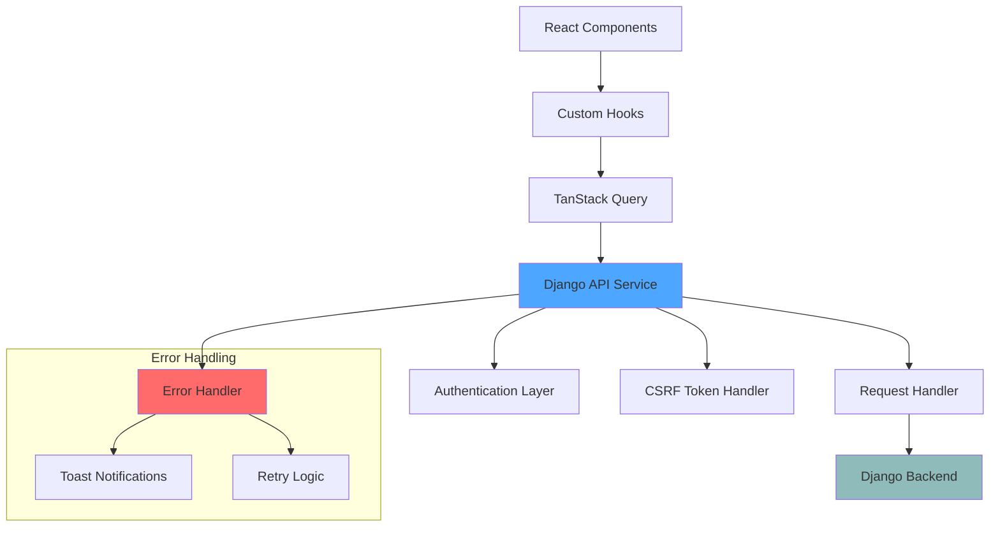

# API Services

This document covers the API service layer in the Broadcast Management System frontend, including the Django API client, request/response handling, authentication integration, and error management.

## Overview

The API service layer provides a clean abstraction between the frontend components and the backend Django REST API. It handles authentication, CSRF protection, request formatting, and error management, while providing type-safe interfaces for all API operations.

## Architecture



## DjangoApiService Class

The central API service class that handles all communication with the Django backend.

### Core Configuration

```typescript
const API_BASE_URL = 'https://app.capparelli.ie/api';

class DjangoApiService {
  private async request<T>(
    endpoint: string, 
    options: RequestInit = {}
  ): Promise<T> {
    const url = `${API_BASE_URL}${endpoint}`;
    
    const defaultHeaders: HeadersInit = {
      'Content-Type': 'application/json',
    };

    // Add CSRF token for non-GET requests
    if (options.method && options.method !== 'GET') {
      const token = await getCsrfToken();
      defaultHeaders['X-CSRFToken'] = token;
    }

    const config: RequestInit = {
      credentials: 'include', // Important for session-based auth
      headers: {
        ...defaultHeaders,
        ...options.headers,
      },
      ...options,
    };

    const response = await fetch(url, config);

    if (!response.ok) {
      const errorData: ApiError = await response.json().catch(() => ({}));
      throw new Error(errorData.detail || errorData.message || `HTTP ${response.status}`);
    }

    return response.json();
  }
}
```

### Key Features

- **Session-Based Authentication**: Automatic cookie handling for Django sessions
- **CSRF Protection**: Automatic CSRF token retrieval and inclusion
- **Type Safety**: Full TypeScript integration with defined interfaces
- **Error Handling**: Consistent error response parsing and throwing
- **Request Standardization**: Unified request configuration and headers

## Authentication Services

### CSRF Token Management

```typescript
let csrfToken: string | null = null;

const getCsrfToken = async (): Promise<string> => {
  if (csrfToken) return csrfToken;
  
  const response = await fetch(`${API_BASE_URL}/csrf/`, {
    credentials: 'include',
  });
  
  if (response.ok) {
    const data = await response.json();
    csrfToken = data.csrfToken;
    return csrfToken!;
  }
  
  throw new Error('Failed to get CSRF token');
};
```

### Authentication Methods

```typescript
class DjangoApiService {
  // User login
  async login(username: string, password: string): Promise<DjangoUser> {
    return this.request<DjangoUser>('/auth/login/', {
      method: 'POST',
      body: JSON.stringify({ username, password }),
    });
  }

  // User logout
  async logout(): Promise<void> {
    await this.request('/auth/logout/', { method: 'POST' });
    csrfToken = null; // Clear cached token
  }

  // Get current user
  async getCurrentUser(): Promise<DjangoUser> {
    return this.request<DjangoUser>('/auth/user/');
  }
}
```

**Key Authentication Features**:
- **Session Persistence**: Leverages Django session framework
- **Automatic Token Management**: CSRF tokens handled transparently
- **Secure Logout**: Proper session cleanup on logout
- **User Validation**: Current user retrieval for session validation

## User & Profile Services

### Profile Management

```typescript
// Get all profiles with pagination
async getProfiles(): Promise<ApiResponse<Profile>> {
  return this.request<ApiResponse<Profile>>('/profiles/');
}

// Get specific profile
async getProfile(id: number): Promise<Profile> {
  return this.request<Profile>(`/profiles/${id}/`);
}

// Create new profile
async createProfile(data: Partial<Profile>): Promise<Profile> {
  return this.request<Profile>('/profiles/', {
    method: 'POST',
    body: JSON.stringify(data),
  });
}

// Update existing profile
async updateProfile(id: number, data: Partial<Profile>): Promise<Profile> {
  return this.request<Profile>(`/profiles/${id}/`, {
    method: 'PATCH',
    body: JSON.stringify(data),
  });
}
```

**Profile Service Features**:
- **CRUD Operations**: Complete Create, Read, Update, Delete functionality
- **Partial Updates**: Support for PATCH operations with partial data
- **Type Safety**: Strongly typed request and response interfaces
- **Validation**: Client-side and server-side validation integration

## Configuration Services

### Location & Facility Management

```typescript
// Locations
async getLocations(): Promise<ApiResponse<Location>> {
  return this.request<ApiResponse<Location>>('/locations/');
}

async createLocation(data: Partial<Location>): Promise<Location> {
  return this.request<Location>('/locations/', {
    method: 'POST',
    body: JSON.stringify(data),
  });
}

// Facilities
async getFacilities(): Promise<ApiResponse<Facility>> {
  return this.request<ApiResponse<Facility>>('/facilities/');
}

async createFacility(data: Partial<Facility>): Promise<Facility> {
  return this.request<Facility>('/facilities/', {
    method: 'POST',
    body: JSON.stringify(data),
  });
}
```

### Shift Management

```typescript
async getShifts(): Promise<ApiResponse<Shift>> {
  return this.request<ApiResponse<Shift>>('/shifts/');
}

async createShift(data: Partial<Shift>): Promise<Shift> {
  return this.request<Shift>('/shifts/', {
    method: 'POST',
    body: JSON.stringify(data),
  });
}
```

## Time Management Services

### Time Entry Operations

```typescript
// Get time entries with optional user filtering
async getTimeEntries(userId?: number): Promise<ApiResponse<TimeEntry>> {
  const params = userId ? `?user=${userId}` : '';
  return this.request<ApiResponse<TimeEntry>>(`/time-entries/${params}`);
}

// Create time entry
async createTimeEntry(data: Partial<TimeEntry>): Promise<TimeEntry> {
  return this.request<TimeEntry>('/time-entries/', {
    method: 'POST',
    body: JSON.stringify(data),
  });
}

// Update time entry
async updateTimeEntry(id: number, data: Partial<TimeEntry>): Promise<TimeEntry> {
  return this.request<TimeEntry>(`/time-entries/${id}/`, {
    method: 'PATCH',
    body: JSON.stringify(data),
  });
}
```

### Time Off Requests

```typescript
// Get time off requests with optional user filtering
async getTimeOffRequests(userId?: number): Promise<ApiResponse<TimeOffRequest>> {
  const params = userId ? `?user=${userId}` : '';
  return this.request<ApiResponse<TimeOffRequest>>(`/time-off-requests/${params}`);
}

// Create time off request
async createTimeOffRequest(data: Partial<TimeOffRequest>): Promise<TimeOffRequest> {
  return this.request<TimeOffRequest>('/time-off-requests/', {
    method: 'POST',
    body: JSON.stringify(data),
  });
}

// Update time off request (approval/rejection)
async updateTimeOffRequest(id: number, data: Partial<TimeOffRequest>): Promise<TimeOffRequest> {
  return this.request<TimeOffRequest>(`/time-off-requests/${id}/`, {
    method: 'PATCH',
    body: JSON.stringify(data),
  });
}
```

## Scheduling Services

### Event Management

```typescript
// Get scheduled events
async getScheduledEvents(): Promise<ApiResponse<ScheduledEvent>> {
  return this.request<ApiResponse<ScheduledEvent>>('/scheduled-events/');
}

// Create scheduled event
async createScheduledEvent(data: Partial<ScheduledEvent>): Promise<ScheduledEvent> {
  return this.request<ScheduledEvent>('/scheduled-events/', {
    method: 'POST',
    body: JSON.stringify(data),
  });
}

// Update scheduled event
async updateScheduledEvent(id: number, data: Partial<ScheduledEvent>): Promise<ScheduledEvent> {
  return this.request<ScheduledEvent>(`/scheduled-events/${id}/`, {
    method: 'PATCH',
    body: JSON.stringify(data),
  });
}
```

**Scheduling Features**:
- **Event CRUD**: Complete event lifecycle management
- **Assignment Management**: User assignment to events
- **Status Tracking**: Event status updates and tracking
- **Conflict Detection**: Client-side scheduling conflict detection

## Ticket Management Services

### Incident Ticket Operations

```typescript
// Get incident types for categorization
async getIncidentTypes(): Promise<ApiResponse<IncidentType>> {
  return this.request<ApiResponse<IncidentType>>('/incident-types/');
}

// Get all incident tickets
async getIncidentTickets(): Promise<ApiResponse<IncidentTicket>> {
  return this.request<ApiResponse<IncidentTicket>>('/incident-tickets/');
}

// Get specific incident ticket
async getIncidentTicket(id: number): Promise<IncidentTicket> {
  return this.request<IncidentTicket>(`/incident-tickets/${id}/`);
}

// Create incident ticket
async createIncidentTicket(data: Partial<IncidentTicket>): Promise<IncidentTicket> {
  return this.request<IncidentTicket>('/incident-tickets/', {
    method: 'POST',
    body: JSON.stringify(data),
  });
}

// Update incident ticket
async updateIncidentTicket(id: number, data: Partial<IncidentTicket>): Promise<IncidentTicket> {
  return this.request<IncidentTicket>(`/incident-tickets/${id}/`, {
    method: 'PATCH',
    body: JSON.stringify(data),
  });
}
```

### Service Ticket Operations

```typescript
// Service ticket management (similar pattern to incident tickets)
async getServiceTickets(): Promise<ApiResponse<ServiceTicket>> {
  return this.request<ApiResponse<ServiceTicket>>('/service-tickets/');
}

async getServiceTicket(id: number): Promise<ServiceTicket> {
  return this.request<ServiceTicket>(`/service-tickets/${id}/`);
}

async createServiceTicket(data: Partial<ServiceTicket>): Promise<ServiceTicket> {
  return this.request<ServiceTicket>('/service-tickets/', {
    method: 'POST',
    body: JSON.stringify(data),
  });
}

async updateServiceTicket(id: number, data: Partial<ServiceTicket>): Promise<ServiceTicket> {
  return this.request<ServiceTicket>(`/service-tickets/${id}/`, {
    method: 'PATCH',
    body: JSON.stringify(data),
  });
}
```

## Communication Services

### Email Integration

```typescript
// Send email through Django backend
async sendEmail(data: {
  to: string[];
  subject: string;
  message: string;
  html?: string;
}): Promise<void> {
  await this.request('/send-email/', {
    method: 'POST',
    body: JSON.stringify(data),
  });
}
```

**Email Features**:
- **Multi-recipient**: Support for multiple email recipients
- **HTML Support**: Rich HTML email content
- **Django Integration**: Leverages Django's email framework
- **Error Handling**: Proper error handling for email failures

## Error Handling

### Error Types

```typescript
export interface ApiError {
  detail?: string;               // General error message
  message?: string;              // Alternative message field
  errors?: Record<string, string[]>; // Field-specific validation errors
}
```

### Error Handling Patterns

```typescript
try {
  const user = await djangoApi.login(username, password);
  // Handle success
} catch (error) {
  if (error instanceof Error) {
    // Handle API error
    toast({
      title: "Login Failed",
      description: error.message,
      variant: "destructive",
    });
  }
}
```

### Global Error Handling

```typescript
// In the request method
if (!response.ok) {
  const errorData: ApiError = await response.json().catch(() => ({}));
  
  // Handle different error types
  if (response.status === 401) {
    // Unauthorized - redirect to login
    window.location.href = '/login';
  } else if (response.status === 403) {
    // Forbidden - show access denied
    throw new Error('Access denied');
  } else if (response.status >= 500) {
    // Server error
    throw new Error('Server error - please try again later');
  } else {
    // Client error
    throw new Error(errorData.detail || errorData.message || `HTTP ${response.status}`);
  }
}
```

## Request/Response Patterns

### Pagination Support

All list endpoints return paginated responses:

```typescript
interface ApiResponse<T> {
  results?: T[];      // Array of items
  count?: number;     // Total count
  next?: string;      // Next page URL
  previous?: string;  // Previous page URL
}
```

### Query Parameters

```typescript
// Example with filtering and pagination
async getTimeEntries(filters: {
  user?: number;
  date?: string;
  status?: string;
  page?: number;
  page_size?: number;
}): Promise<ApiResponse<TimeEntry>> {
  const params = new URLSearchParams();
  
  Object.entries(filters).forEach(([key, value]) => {
    if (value !== undefined) {
      params.append(key, value.toString());
    }
  });
  
  const queryString = params.toString();
  const endpoint = `/time-entries/${queryString ? `?${queryString}` : ''}`;
  
  return this.request<ApiResponse<TimeEntry>>(endpoint);
}
```

## Service Integration Patterns

### TanStack Query Integration

```typescript
// Custom hooks using the service
export const useIncidentTickets = () => {
  return useQuery({
    queryKey: ['incident-tickets'],
    queryFn: () => djangoApi.getIncidentTickets(),
    staleTime: 5 * 60 * 1000, // 5 minutes
  });
};

export const useCreateIncidentTicket = () => {
  const queryClient = useQueryClient();
  
  return useMutation({
    mutationFn: (data: Partial<IncidentTicket>) => 
      djangoApi.createIncidentTicket(data),
    onSuccess: () => {
      queryClient.invalidateQueries(['incident-tickets']);
    },
  });
};
```

### Context Integration

```typescript
// In AuthContext
const login = async (username: string, password: string): Promise<boolean> => {
  try {
    const loggedInUser = await djangoApi.login(username, password);
    setUser(loggedInUser);
    return true;
  } catch (error) {
    return false;
  }
};
```

## Performance Optimizations

### Request Deduplication
TanStack Query automatically deduplicates identical requests:

```typescript
// Multiple components calling this will only result in one request
const { data } = useQuery({
  queryKey: ['profiles'],
  queryFn: () => djangoApi.getProfiles(),
});
```

### Caching Strategy
- **Stale-While-Revalidate**: Keep stale data while fetching fresh data
- **Background Updates**: Automatic background refresh of cached data
- **Selective Invalidation**: Invalidate specific queries on mutations

### Request Optimization
- **Parallel Requests**: Use Promise.all for independent requests
- **Request Batching**: Combine related requests where possible
- **Conditional Requests**: Only fetch when needed (enabled flag)

## Testing Strategies

### Mock Service

```typescript
// Mock for testing
export const mockDjangoApi = {
  login: jest.fn(),
  getProfiles: jest.fn(),
  createProfile: jest.fn(),
  // ... other methods
};
```

### Service Testing

```typescript
describe('DjangoApiService', () => {
  beforeEach(() => {
    fetchMock.resetMocks();
  });

  test('login success', async () => {
    const mockUser = { id: 1, username: 'test' };
    fetchMock.mockResponseOnce(JSON.stringify(mockUser));

    const result = await djangoApi.login('test', 'password');
    expect(result).toEqual(mockUser);
  });

  test('login failure', async () => {
    fetchMock.mockResponseOnce('', { status: 401 });

    await expect(djangoApi.login('test', 'wrong')).rejects.toThrow();
  });
});
```

## Best Practices

### API Design
- **Consistent Interfaces**: All endpoints follow similar patterns
- **Type Safety**: Full TypeScript integration
- **Error Handling**: Consistent error response handling
- **Documentation**: Clear method documentation and examples

### Security
- **CSRF Protection**: Automatic CSRF token handling
- **Session Security**: Secure cookie handling
- **Input Validation**: Client-side validation before API calls
- **Error Privacy**: Don't expose sensitive information in errors

### Performance
- **Request Optimization**: Minimize unnecessary requests
- **Caching**: Leverage browser and TanStack Query caching
- **Error Recovery**: Implement retry logic for transient errors
- **Loading States**: Provide clear loading feedback to users

## Future Enhancements

### Planned Improvements
- **Request Interceptors**: Global request/response transformation
- **Retry Logic**: Automatic retry for failed requests
- **Offline Support**: Queue requests when offline
- **Real-time Updates**: WebSocket integration for live data
- **API Versioning**: Support for multiple API versions 