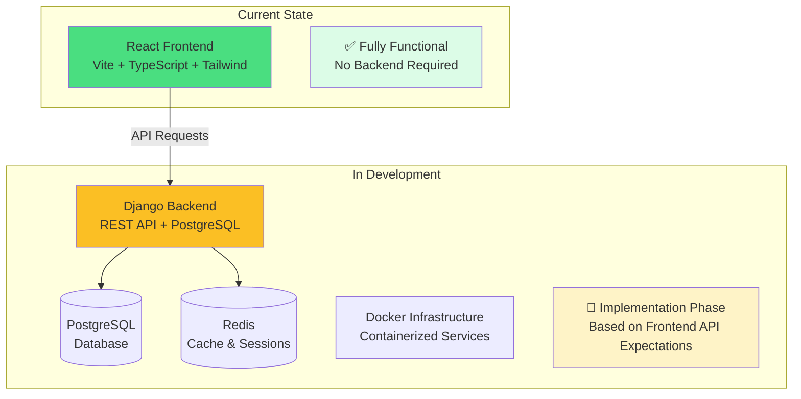

# Broadcast Management System Documentation

Welcome to the comprehensive documentation for the Broadcast Management System (BMS). This documentation covers both the frontend React application and the backend Django implementation.

## Overview

The Broadcast Management System is a comprehensive platform designed for media organizations to manage broadcast content, scheduling, and operations. The system enables broadcasters to efficiently organize content, create and maintain broadcast schedules, manage user permissions, and automate various aspects of the broadcasting workflow.

## Quick Links

=== "Frontend"

    **Current Status**: ✅ Fully functional React application
    
    - [Frontend Architecture](frontend/architecture.md) - Component structure and design patterns
    - [Components Overview](frontend/components/overview.md) - Reusable UI components
    - [Pages Documentation](frontend/pages/overview.md) - Main application pages
    - [Data Types](frontend/types.md) - TypeScript interfaces and types
    - [API Services](frontend/services.md) - API integration layer

=== "Backend"

    **Current Status**: 🚧 In development (Django + PostgreSQL + Docker)
    
    - [Architecture Design](backend/architecture.md) - Backend system architecture
    - [API Endpoints](backend/api-endpoints.md) - RESTful API specification
    - [Database Models](backend/models.md) - Django model definitions
    - [Authentication](backend/authentication.md) - Session-based auth system
    - [Docker Setup](backend/docker-setup.md) - Containerized deployment

=== "Implementation"

    **Current Status**: 📋 Planning complete, ready for implementation
    
    - [Implementation Overview](implementation/overview.md) - Development roadmap
    - [Phase 1: Docker Infrastructure](implementation/phase1-docker.md) - Container setup
    - [Phase 2: Backend Development](implementation/phase2-backend.md) - Django implementation
    - [Phase 3: Integration](implementation/phase3-integration.md) - Frontend-backend integration
    - [Timeline](implementation/timeline.md) - Project schedule and milestones

## System Architecture

## Key Features

### User Management
- Role-based access control with predefined roles
- User authentication and authorization
- Profile management with department assignments
- Activity logging and audit trails

### Broadcast Crew Scheduling
- Calendar-based scheduling interface
- Drag-and-drop schedule creation and editing
- Conflict detection and resolution
- Recurring broadcast scheduling
- Schedule templates and validation

### Time Tracking
- Digital time clock functionality
- Break time management
- Timesheet approval workflows
- Overtime calculation and reporting

### Incident & Service Management
- Incident reporting and tracking
- Service request management
- Ticket assignment and status tracking
- Resolution documentation

### Reporting and Analytics
- Broadcast schedule reports
- Time tracking analytics
- User activity reports
- Customizable dashboards

## Technology Stack

### Frontend (Current)
- **Framework**: React 18 with TypeScript
- **Build Tool**: Vite
- **Styling**: Tailwind CSS + shadcn/ui components
- **State Management**: React Context API
- **Forms**: React Hook Form + Zod validation
- **Data Fetching**: TanStack Query (React Query)
- **Routing**: React Router v6

### Backend (In Development)
- **Framework**: Django 4.2 with Django REST Framework
- **Database**: PostgreSQL 14
- **Caching**: Redis
- **Task Queue**: Celery
- **Authentication**: Session-based with CSRF protection
- **Deployment**: Docker with Docker Compose

## Getting Started

### For Frontend Development
1. [Development Setup](getting-started/development-setup.md) - Set up the React development environment
2. [Frontend Architecture](frontend/architecture.md) - Understand the application structure
3. [Component Overview](frontend/components/overview.md) - Learn about reusable components

### For Backend Development
1. [Backend Architecture](backend/architecture.md) - Understand the planned backend structure
2. [Docker Setup](backend/docker-setup.md) - Set up the development environment
3. [Implementation Plan](implementation/overview.md) - Follow the development roadmap

### For Contributors
1. [Contributing Guide](development/contributing.md) - How to contribute to the project
2. [Code Standards](development/code-standards.md) - Coding conventions and best practices
3. [Testing](development/testing.md) - Testing strategies and guidelines

## Project Status

| Component | Status | Description |
|-----------|--------|-------------|
| **Frontend Application** | ✅ Complete | Fully functional React app with all features |
| **UI Components** | ✅ Complete | Comprehensive component library with shadcn/ui |
| **Authentication Flow** | ✅ Complete | Ready for backend integration |
| **API Service Layer** | ✅ Complete | Structured to work with Django backend |
| **Backend Architecture** | 📋 Designed | Detailed architectural decisions completed |
| **Docker Infrastructure** | 📋 Designed | Development and production configurations planned |
| **Django Backend** | 🚧 In Progress | Implementation starting with Phase 1 |
| **Database Models** | 📋 Designed | Django models mapped to frontend requirements |
| **API Endpoints** | 📋 Designed | RESTful API specification complete |

## Documentation Sections

- **[Getting Started](getting-started/overview.md)** - Setup and installation guides
- **[Frontend Documentation](frontend/architecture.md)** - Complete frontend reference
- **[Backend Documentation](backend/architecture.md)** - Backend implementation details
- **[API Reference](api/authentication.md)** - Detailed API endpoint documentation
- **[Implementation Plan](implementation/overview.md)** - Development roadmap and phases
- **[Development](development/contributing.md)** - Contributing and development guidelines

---

!!! info "Documentation Status"
    This documentation is actively maintained and updated as the project evolves. The frontend documentation is complete and reflects the current implementation. Backend documentation represents the planned implementation based on completed architectural design phases.

!!! tip "Need Help?"
    - Check the [FAQ](getting-started/overview.md#faq) for common questions
    - Review the [troubleshooting guide](development/debugging.md) for common issues
    - Submit issues on [GitHub](https://github.com/your-org/broadcast/issues) for bugs or feature requests 