# Broadcast Management System Documentation

Welcome to the comprehensive documentation for the Broadcast Management System (BMS). This documentation covers both the Lovable-developed React frontend application and the Django backend implementation.

## Overview

The Broadcast Management System is a comprehensive platform designed for media organizations to manage broadcast content, scheduling, and operations. The system enables broadcasters to efficiently organize content, create and maintain broadcast schedules, manage user permissions, and automate various aspects of the broadcasting workflow.

## Quick Links

=== "Frontend"

    **Current Status**: ✅ Fully functional React application (developed with Lovable, self-hostable via GitHub)

    - [Frontend Architecture](frontend/architecture.md) - Component structure and design patterns
    - [Components Overview](frontend/components/overview.md) - Reusable UI components
    - [Pages Documentation](frontend/pages/overview.md) - Main application pages
    - [Data Types](frontend/types.md) - TypeScript interfaces and types
    - [API Services](frontend/services.md) - API integration layer
    - [Lovable Integration](frontend/lovable-integration.md) - Development and self-hosting options

=== "Backend"

    **Current Status**: 🚧 Implementation in progress (Django + PostgreSQL + Docker)

    - [Architecture Design](backend/architecture.md) - Backend system architecture
    - [API Endpoints](backend/api-endpoints.md) - RESTful API specification
    - [Database Models](backend/models.md) - Django model definitions
    - [Authentication](backend/authentication.md) - Session-based auth system
    - [Docker Setup](backend/docker-setup.md) - Containerized deployment

=== "Implementation"

    **Current Status**: 🚧 Implementation in progress - Phase 2 Backend Development

    - [Backend Implementation](backend-implementation-index.md) - Implementation overview
    - [Phase 1: Docker Infrastructure](implementation/phase1-docker.md) - Container setup ✅
    - [Phase 2: Backend Development](implementation/phase2-backend.md) - Django implementation 🚧
    - [Phase 3: Integration](implementation/phase3-integration.md) - Frontend-backend integration
    - [Timeline](implementation/timeline.md) - Project schedule and milestones

## System Architecture

```mermaid
graph TD
    FE[React Frontend<br/>Vite + TypeScript + Tailwind<br/>Lovable Platform + GitHub]
    BE[Django Backend<br/>REST API + PostgreSQL]
    DB[(PostgreSQL<br/>Database)]
    REDIS[(Redis<br/>Cache & Sessions)]
    CELERY[Celery<br/>Task Queue]
    DOCKER[Docker Infrastructure<br/>Containerized Services]

    FE -->|API Requests| BE
    BE --> DB
    BE --> REDIS
    BE <--> CELERY
    CELERY --> REDIS

    subgraph "Current State - Frontend"
        FE
        direction TB
        FE_NOTE[✅ Fully Functional<br/>Lovable for Dev, GitHub for Self-Hosting]
    end

    subgraph "Current State - Backend"
        BE
        DB
        REDIS
        CELERY
        DOCKER
        direction TB
        BE_NOTE[🚧 Implementation Phase 2<br/>Basic functionality implemented]
    end

    style FE fill:#4ade80
    style FE_NOTE fill:#dcfce7
    style BE fill:#fbbf24
    style BE_NOTE fill:#fef3c7
    style CELERY fill:#fbbf24
```

## Key Features

### User Management

- Role-based access control with predefined roles
- User authentication and authorization
- Profile management with department assignments
- Activity logging and audit trails

### Broadcast Crew Scheduling

- Calendar-based scheduling interface
- Drag-and-drop schedule creation and editing
- Conflict detection and resolution
- Recurring broadcast scheduling
- Schedule templates and validation

### Time Tracking

- Digital time clock functionality
- Break time management
- Timesheet approval workflows
- Overtime calculation and reporting

### Incident & Service Management

- Incident reporting and tracking
- Service request management
- Ticket assignment and status tracking
- Resolution documentation

### Reporting and Analytics

- Broadcast schedule reports
- Time tracking analytics
- User activity reports
- Customizable dashboards

## Technology Stack

### Frontend

- **Framework**: React 18 with TypeScript
- **Build Tool**: Vite
- **Styling**: Tailwind CSS + shadcn/ui components
- **State Management**: React Context API + TanStack Query
- **Forms**: React Hook Form + Zod validation
- **Routing**: React Router v6
- **Development**: Lovable platform with GitHub synchronization for self-hosting

### Backend

- **Framework**: Django 4.2 with Django REST Framework
- **Database**: PostgreSQL 14
- **Caching**: Redis
- **Task Queue**: Celery
- **Authentication**: Session-based with CSRF protection
- **Deployment**: Docker with Docker Compose

## Getting Started

### For Frontend Development

1. [Development Setup](getting-started/development-setup.md) - Set up the React development environment
2. [Lovable Integration](frontend/lovable-integration.md) - Learn to work with Lovable and GitHub
3. [Frontend Architecture](frontend/architecture.md) - Understand the application structure
4. [Component Overview](frontend/components/overview.md) - Learn about reusable components

### For Backend Development

1. [Backend Architecture](backend/architecture.md) - Understand the backend structure
2. [Docker Setup](backend/docker-setup.md) - Set up the development environment
3. [Backend Implementation](backend-implementation-index.md) - Follow the development roadmap

### For Contributors

1. [Contributing Guide](development/contributing.md) - How to contribute to the project
2. [Code Standards](development/code-standards.md) - Coding conventions and best practices
3. [Testing](development/testing.md) - Testing strategies and guidelines

## Project Status

| Component                    | Status         | Description                                           |
| ---------------------------- | -------------- | ----------------------------------------------------- |
| **Frontend Application**     | ✅ Complete    | Fully functional React app with all features          |
| **UI Components**            | ✅ Complete    | Comprehensive component library with shadcn/ui        |
| **Authentication Flow**      | ✅ Complete    | Ready for backend integration                         |
| **API Service Layer**        | ✅ Complete    | Structured to work with Django backend                |
| **Lovable Integration**      | ✅ Complete    | Development with GitHub sync for self-hosting         |
| **Docker Infrastructure**    | ✅ Complete    | Development and production configurations implemented |
| **Django Project Structure** | ✅ Complete    | Basic project structure established                   |
| **Django Models**            | 🚧 In Progress | Core models implemented                               |
| **API Endpoints**            | 🚧 In Progress | Basic endpoints implemented                           |
| **Celery Integration**       | ✅ Complete    | Task queue set up and functioning                     |
| **Authentication System**    | 🚧 In Progress | Session-based auth implementation                     |

## Documentation Sections

- **[Getting Started](getting-started/overview.md)** - Setup and installation guides
- **[Frontend Documentation](frontend/architecture.md)** - Complete frontend reference
- **[Backend Documentation](backend/architecture.md)** - Backend implementation details
- **[API Reference](api/authentication.md)** - Detailed API endpoint documentation
- **[Implementation Plan](backend-implementation-index.md)** - Development roadmap and phases
- **[Development](development/contributing.md)** - Contributing and development guidelines

---

!!! info "Documentation Status"
This documentation is actively maintained and updated as the project evolves. The frontend documentation reflects the current Lovable-developed implementation with GitHub synchronization for self-hosting. Backend documentation is being updated as the Django implementation progresses.

!!! tip "Need Help?" - Check the [FAQ](getting-started/overview.md#faq) for common questions - Review the [troubleshooting guide](development/debugging.md) for common issues - Submit issues on [GitHub](https://github.com/your-org/broadcast/issues) for bugs or feature requests
