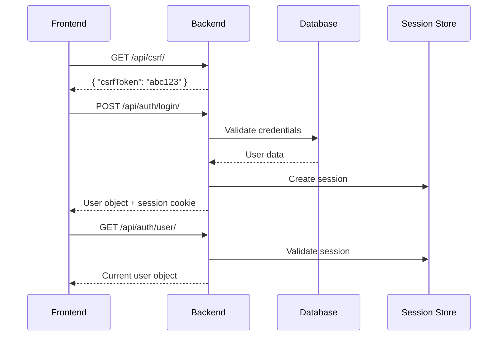

# 🎨 CREATIVE PHASE: AUTHENTICATION ARCHITECTURE

## Problem Statement

Design an authentication system that integrates seamlessly with the existing React frontend without requiring any frontend modifications, while maintaining security best practices and providing audit capabilities.

## Requirements & Constraints

### Frontend Expectations
- Session-based authentication (not JWT)
- CSRF token handling for non-GET requests
- Login/logout endpoints with specific response formats
- Current user endpoint that returns user details
- Automatic session validation on page load

### Security Requirements
- CSRF protection for all state-changing operations
- Secure session management
- Password security best practices
- Audit logging for authentication events

### Integration Constraints
- Cannot modify existing frontend AuthContext
- Must match exact API responses expected by frontend
- Must work with existing django-api.ts service layer

## Authentication Architecture Options Analyzed

### Option 1: Standard Django Session Authentication
**Complexity**: Low | **Implementation**: 1 week | **Frontend Compatibility**: Medium

**Pros:**
- Simple implementation with minimal configuration
- Well-tested and secure by default
- Built-in CSRF protection

**Cons:**
- Limited customization for specific frontend needs
- May not match exact response formats expected
- Session storage only in database

### Option 2: Custom Authentication Views with Session Backend
**Complexity**: Medium | **Implementation**: 1.5 weeks | **Frontend Compatibility**: High

**Pros:**
- Exact control over API response formats
- Can match frontend expectations precisely
- Maintains Django session security
- Custom error handling and validation

**Cons:**
- More implementation work required
- Need to ensure security best practices

### Option 3: Django REST Framework Authentication
**Complexity**: Medium | **Implementation**: 2 weeks | **Frontend Compatibility**: Medium-High

**Pros:**
- Leverages DRF's robust authentication framework
- Built-in throttling and permission classes
- Good integration with rest of API

**Cons:**
- May be overkill for session-only auth
- DRF responses might need customization

### Option 4: Hybrid Session Auth with Custom Response Layer
**Complexity**: Medium | **Implementation**: 1.5 weeks | **Frontend Compatibility**: High

**Pros:**
- Maintains Django session security
- Guaranteed frontend compatibility
- Flexible response formatting
- Easy to audit and maintain

**Cons:**
- Requires careful response mapping
- Additional abstraction layer

## Decision: Hybrid Session Auth with Custom Response Layer (Option 4)

### Rationale
1. **Frontend Compatibility**: Guarantees exact response formats expected by frontend
2. **Security**: Leverages proven Django session security
3. **Maintainability**: Clear separation between authentication logic and response formatting
4. **Future-Proof**: Can add features without breaking existing frontend
5. **Development Speed**: Balances implementation time with reliability

## Implementation Plan

### 1. Authentication Service Layer
```python
class AuthenticationService:
    def authenticate_user(self, username, password):
        """Authenticate user and create session"""
        pass
    
    def get_current_user(self, request):
        """Get current authenticated user"""
        pass
    
    def logout_user(self, request):
        """Logout user and clear session"""
        pass
    
    def format_user_response(self, user):
        """Format user data for frontend consumption"""
        pass
```

### 2. Custom Authentication Views
```python
class LoginView(APIView):
    def post(self, request):
        # Custom validation and session creation
        # Returns exact format expected by frontend
        pass

class CurrentUserView(APIView):
    def get(self, request):
        # Returns current user in expected format
        pass
```

### 3. Session Configuration
```python
SESSION_ENGINE = 'django.contrib.sessions.backends.db'
SESSION_COOKIE_AGE = 86400  # 24 hours
SESSION_COOKIE_SECURE = True  # Production
SESSION_COOKIE_HTTPONLY = True
CSRF_COOKIE_SECURE = True
CSRF_TRUSTED_ORIGINS = ['https://your-frontend-domain.com']
```

### 4. Response Format Compatibility
```python
# Login response must match frontend expectations
{
    "id": 1,
    "username": "john.doe",
    "first_name": "John",
    "last_name": "Doe",
    "email": "john.doe@example.com",
    "is_active": True
}
```

## Authentication Flow



## Security Implementation

### 1. Password Security
- Django's built-in password hashing
- Password strength requirements
- Rate limiting for login attempts

### 2. Session Security
- Secure session cookies
- Session timeout management
- Session invalidation on logout

### 3. CSRF Protection
- Proper CSRF token validation
- Trusted origins configuration
- Secure cookie settings

### 4. Audit Logging
```python
class AuthenticationAuditLog(models.Model):
    user = models.ForeignKey(User, on_delete=models.SET_NULL, null=True)
    action = models.CharField(max_length=50)
    ip_address = models.GenericIPAddressField()
    user_agent = models.TextField()
    timestamp = models.DateTimeField(auto_now_add=True)
    success = models.BooleanField()
```

## Verification

✅ **Session-based Authentication**: Using Django sessions exactly as frontend expects  
✅ **CSRF Protection**: Implemented with proper token handling  
✅ **Response Format Compatibility**: Custom response layer ensures exact format matching  
✅ **Frontend Integration**: No frontend changes required  
✅ **Security**: Leverages Django's proven security features  
✅ **Audit Logging**: Comprehensive authentication event logging

## Next Steps

1. Implement custom authentication views with response formatting
2. Configure Django session settings for security
3. Create authentication service layer
4. Implement audit logging model
5. Test authentication flow with existing frontend code 