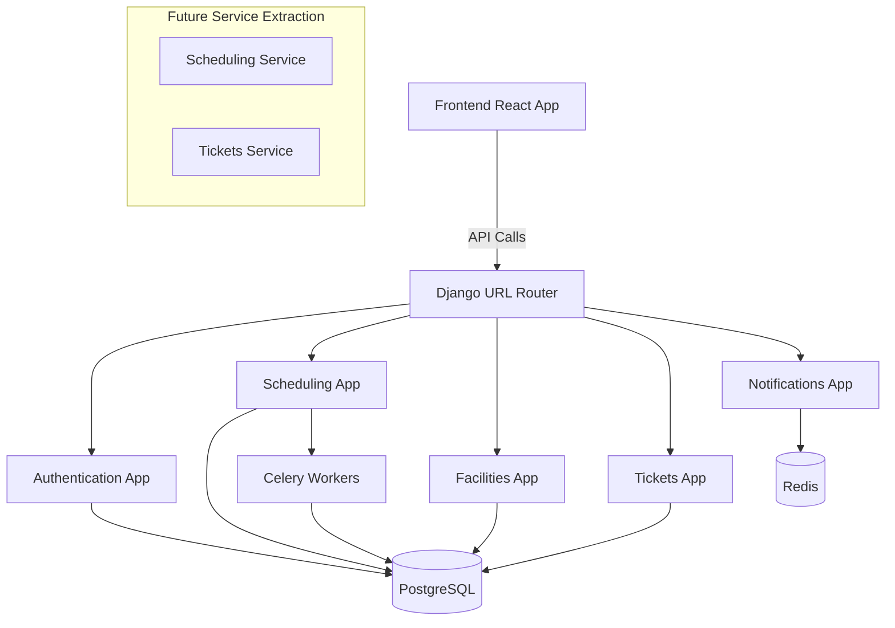

# 🎨 CREATIVE PHASE: BACKEND ARCHITECTURE DESIGN

## Problem Statement

Design the overall backend architecture for the Broadcast Management System that integrates seamlessly with the existing frontend while providing a robust, scalable foundation for future growth.

## Requirements & Constraints

### Functional Requirements
- Support all existing frontend API expectations
- Maintain existing authentication flow
- Handle complex scheduling and time tracking operations
- Support real-time notifications (future capability)
- Provide comprehensive reporting capabilities

### Technical Constraints
- Must work with existing React frontend without modifications
- Docker-based deployment required
- PostgreSQL database required
- Session-based authentication with CSRF protection
- Must support 10+ concurrent users initially
- 2-second page load time requirement

### Business Constraints
- Frontend must remain completely intact
- Minimal disruption to current workflow
- Development timeline of 7-11 weeks

## Architecture Options Analyzed

### Option 1: Monolithic Django Application
**Complexity**: Low | **Implementation**: 4-5 weeks | **Scalability**: Medium

**Pros:**
- Simple deployment and management
- Easy to develop and debug initially
- Single database connection management
- Straightforward authentication handling

**Cons:**
- Harder to scale individual components
- Single point of failure
- Database bottleneck as system grows

### Option 2: Modular Django with App Separation
**Complexity**: Medium | **Implementation**: 5-6 weeks | **Scalability**: Medium-High

**Pros:**
- Clear separation of concerns
- Easier to maintain and test individual modules
- Single deployment simplicity
- Good balance of organization and simplicity

**Cons:**
- Still deployed as single unit
- Shared database can become bottleneck
- Some coupling between apps inevitable

### Option 3: Microservices with API Gateway
**Complexity**: High | **Implementation**: 8-10 weeks | **Scalability**: High

**Pros:**
- Independent scaling of services
- Technology flexibility per service
- Clear service boundaries
- Fault isolation

**Cons:**
- Complex deployment and orchestration
- Network latency between services
- Over-engineering for current requirements

### Option 4: Hybrid - Modular Monolith with Service Extraction Points
**Complexity**: Medium | **Implementation**: 5-6 weeks | **Scalability**: High (future)

**Pros:**
- Start simple, evolve complexity as needed
- Clear module boundaries enable future service extraction
- Single deployment initially
- Good balance of current needs and future flexibility

**Cons:**
- Requires disciplined architecture design
- May over-engineer some interfaces initially

## Decision: Hybrid Modular Monolith (Option 4)

### Rationale
1. **Frontend Compatibility**: Single Django deployment simplifies API routing and authentication
2. **Development Speed**: Meets the 7-11 week timeline while providing good architecture
3. **Future Scalability**: Clear module boundaries allow extraction of high-load services later
4. **Team Efficiency**: Single deployment reduces DevOps complexity
5. **Risk Management**: Lower risk than microservices, higher flexibility than pure monolith

## Implementation Plan

### 1. Django Project Structure
```
broadcast_backend/
├── backend/                 # Main Django project
├── apps/
│   ├── authentication/     # User auth and profiles
│   ├── scheduling/         # Events and time tracking
│   ├── facilities/         # Locations and equipment
│   ├── tickets/            # Incident and service tickets
│   ├── notifications/      # System notifications
│   └── core/              # Shared utilities
├── docker/                 # Docker configurations
└── docs/                  # API documentation
```

### 2. Service Layer Design
- Clear service boundaries within monolith
- Interface-based design for future extraction
- Dependency injection for loose coupling

### 3. Database Architecture
- Single PostgreSQL database initially
- Clear table prefixes for each domain
- Foreign key design supports future separation

### 4. API Design
- URL routing mimics API gateway pattern
- Consistent response formats across modules
- Centralized authentication and CSRF handling

## Architecture Diagram



## Verification

✅ **Frontend Integration**: Single API endpoint maintains existing frontend expectations  
✅ **Authentication**: Django session auth with CSRF tokens matches frontend implementation  
✅ **Performance**: Single database queries, Redis caching for performance  
✅ **Scalability**: Modular design allows future service extraction  
✅ **Timeline**: 5-6 weeks fits within 7-11 week constraint  
✅ **Maintenance**: Clear module separation improves maintainability

## Next Steps

1. Implement Django project structure according to this design
2. Create service layer interfaces for each module
3. Set up database schema with clear domain separation
4. Implement API routing with modular URL patterns
5. Configure Docker containers according to this architecture 