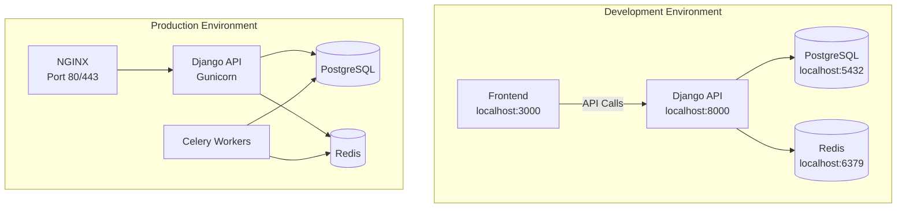

# 🎨 CREATIVE PHASE: DOCKER INFRASTRUCTURE DESIGN

## Problem Statement

Design a Docker infrastructure that supports efficient development, testing, and production deployment of the Django backend while maintaining simplicity for developers and robustness for production environments.

## Requirements & Constraints

### Development Requirements
- Fast development iteration with hot reloading
- Easy database access for debugging
- Simple service orchestration
- Volume mounting for code changes

### Production Requirements
- Secure container configuration
- Optimized image sizes
- Health checks and monitoring
- Backup and recovery capabilities
- SSL/TLS termination

### Operational Constraints
- Must support PostgreSQL and Redis services
- Django application with Celery workers
- Environment-specific configurations
- Secret management capabilities

## Docker Infrastructure Options Analyzed

### Option 1: Single Container with External Services
**Complexity**: Low | **Development Experience**: Medium | **Production Readiness**: Medium

**Pros:**
- Simple container management
- Easy to scale Django independently
- Reduces container orchestration complexity

**Cons:**
- Requires external service setup
- Network configuration complexity
- Less portable development environment

### Option 2: Multi-Container with Docker Compose
**Complexity**: Medium | **Development Experience**: High | **Production Readiness**: High

**Pros:**
- Complete environment isolation
- Easy to replicate across environments
- Clear service separation
- Portable development setup

**Cons:**
- More complex orchestration
- Network management between containers
- Volume management for data persistence

### Option 3: Kubernetes Deployment
**Complexity**: High | **Development Experience**: Low | **Production Readiness**: Very High

**Pros:**
- Production-grade orchestration
- Auto-scaling capabilities
- Service discovery and load balancing
- Superior monitoring and logging

**Cons:**
- High complexity for initial implementation
- Over-engineering for current scale
- Complex development environment setup

### Option 4: Hybrid Compose with Production Variants
**Complexity**: Medium | **Development Experience**: High | **Production Readiness**: High

**Pros:**
- Best of both worlds approach
- Simple development experience
- Production-ready deployment options
- Can evolve to Kubernetes later

**Cons:**
- Multiple configuration files to maintain
- Need to ensure parity between environments

## Decision: Hybrid Compose with Production Variants (Option 4)

### Rationale
1. **Development Experience**: Simple `docker-compose up` gets full environment running
2. **Production Ready**: Optimized configurations for production deployment
3. **Scalability**: Can evolve to Kubernetes without major architecture changes
4. **Maintainability**: Clear separation of concerns with manageable complexity
5. **Team Efficiency**: Developers can work without complex setup requirements

## Implementation Plan

### 1. Container Architecture
```
broadcast-backend/
├── docker/
│   ├── django/
│   │   ├── Dockerfile.dev
│   │   ├── Dockerfile.prod
│   │   └── entrypoint.sh
│   ├── nginx/
│   │   ├── Dockerfile
│   │   └── conf.d/
│   └── postgres/
│       └── init.sql
├── docker-compose.yml          # Development
├── docker-compose.prod.yml     # Production
└── docker-compose.staging.yml  # Staging
```

### 2. Development Configuration
```yaml
# docker-compose.yml (Development)
version: '3.8'
services:
  db:
    image: postgres:14
    environment:
      POSTGRES_DB: broadcast_dev
      POSTGRES_USER: postgres
      POSTGRES_PASSWORD: postgres
    volumes:
      - postgres_data:/var/lib/postgresql/data
    ports:
      - "5432:5432"
  
  web:
    build:
      context: .
      dockerfile: docker/django/Dockerfile.dev
    command: python manage.py runserver 0.0.0.0:8000
    volumes:
      - .:/app
    ports:
      - "8000:8000"
    depends_on:
      - db
      - redis
```

### 3. Production Configuration
```yaml
# docker-compose.prod.yml (Production)
services:
  web:
    build:
      dockerfile: docker/django/Dockerfile.prod
    command: gunicorn backend.wsgi:application --bind 0.0.0.0:8000
    volumes:
      - static_volume:/app/staticfiles
    restart: always
  
  nginx:
    build: ./docker/nginx
    volumes:
      - static_volume:/app/staticfiles
    ports:
      - "80:80"
      - "443:443"
    restart: always
```

### 4. Multi-Stage Production Dockerfile
```dockerfile
# docker/django/Dockerfile.prod
FROM python:3.10-slim as builder
WORKDIR /app
COPY requirements.txt .
RUN pip install --user -r requirements.txt

FROM python:3.10-slim
RUN useradd -m appuser
COPY --from=builder /root/.local /home/appuser/.local
WORKDIR /app
RUN chown -R appuser:appuser /app
COPY --chown=appuser:appuser . .
USER appuser
ENV PATH=/home/appuser/.local/bin:$PATH
```

## Service Configuration Strategy

### 1. Environment-Specific Settings
```bash
# .env.dev (Development)
DEBUG=1
SECRET_KEY=dev-secret-key
DATABASE_URL=postgres://postgres:postgres@db:5432/broadcast_dev

# .env.prod (Production)
DEBUG=0
SECRET_KEY=${SECRET_KEY}
DATABASE_URL=postgres://${DB_USER}:${DB_PASSWORD}@db:5432/broadcast_prod
```

### 2. Health Checks
```yaml
healthcheck:
  test: ["CMD", "curl", "-f", "http://localhost:8000/health/"]
  interval: 30s
  timeout: 10s
  retries: 3
```

### 3. Development Workflow
```bash
# Quick start commands
make dev-setup    # Creates .env files and builds containers
make dev-up       # Starts development environment
make db-migrate   # Run Django migrations
make prod-deploy  # Deploy to production
```

## Infrastructure Diagram



## Security Considerations

### 1. Container Security
- Non-root user in production containers
- Multi-stage builds to reduce attack surface
- Environment-specific secret management

### 2. Network Security
- Internal network isolation
- HTTPS termination at NGINX
- Database access restricted to application containers

### 3. Data Security
- Persistent volumes for data storage
- Regular automated backups
- Secure environment variable handling

## Verification

✅ **Development Experience**: One command starts complete environment  
✅ **Production Ready**: Optimized containers with security best practices  
✅ **Service Isolation**: Clear separation between Django, PostgreSQL, Redis  
✅ **Environment Parity**: Consistent configuration across environments  
✅ **Scalability**: Can add more services or migrate to Kubernetes  
✅ **Security**: Non-root containers, environment-specific configurations

## Next Steps

1. Create Docker configuration files according to this design
2. Set up development and production compose files
3. Implement multi-stage Dockerfiles for optimization
4. Create Makefile for common development tasks
5. Set up CI/CD pipeline for automated deployments 